# system-design-P2.md

> 用途：用于 `vi-agent-core` 在 **P2：上下文工程（Context Engineering）+ 会话状态记忆（Session Memory）** 阶段的正式详细设计、代码实施、测试、回归与后续评审。  
> 特点：基于当前项目真实代码快照；采用项目模板结构；直接覆盖已过时或明显错误的旧约束；以 **Context Kernel（通用上下文内核）** 为中心，保证未来可以同时支撑顾问型 Agent 与工具执行型 Agent。

---

## 0. 使用说明

### 0.1 模板适用范围

- 适用：
  - Runtime 主链路向 Context Engineering 演进
  - `RuntimeOrchestrator` / `AgentRunContextFactory` / `SimpleAgentLoopEngine` / `PersistenceCoordinator` / `ConversationMemoryService` 相关重构
  - Working Set / Session State / Conversation Summary / Working Context / Internal LLM Task / Working Context Audit 设计与落地
  - Redis / MySQL 双层治理与新表设计
- 不适用：
  - 纯前端页面与文案改动
  - Delegation / Subagent 正式实现
  - Long-term Memory 正式实现
  - RAG 在线主链路、审批平台、完整审计平台 UI

### 0.2 执行口径

1. 本文档是 **P2 总设计文档**，不是某一个小阶段的任务清单。  
2. 本文档先把整体设计一次性定清楚；开发阶段 A/B/C 的拆分，放到后续单独编排。  
3. 与当前项目旧文档冲突、且已被当前项目状态或更合理设计否定的约束，以本文档为准。  
4. 本文档坚持以下核心边界：
   - **Memory ≠ Message**
   - **WorkingContext ≠ Transcript**
   - **ToolExecution ≠ ToolMessage**
   - **Summary ≠ 压缩后的全部聊天记录**
   - **ContextPolicy 必须独立于具体 provider**
   - **EvidenceRef 必须贯穿 state / summary / context audit**

### 0.3 本稿明确解决的问题

1. 当前 `SessionStateSnapshot` 命名语义错误，实际代表 recent session context cache。  
2. `workingMessages` 与送模消息混用，存在派生上下文污染 Working Set 的风险。  
3. 缺少正式的 `WorkingContext` 核心对象，只能依赖 `List<Message>` 临时送模。  
4. 缺少 `ContextPolicy / ContextBudget / CompactionPolicy / WorkingContextValidator` 等一等对象。  
5. 缺少 `Session State / Summary / Evidence / Working Context Audit` 的正式持久化与调试出口。  
6. `Internal LLM Task` 缺少专用调用边界。  
7. `PersistenceCoordinator` 职责过重，缺少门面保留、内部拆协作者的标准方案。

---

## 1. 文档元信息

- 文档名称：`system-design-P2.md`
- 变更主题：`P2 Context Kernel（上下文内核）详细系统设计`
- 目标分支 / 迭代：`p2/context-kernel`
- 文档版本：`v5.0`
- 状态：`Review`
- 作者：`ChatGPT`
- 评审人：`Victor Yu`
- 关联文档：
  - `AGENTS.md`
  - `ARCHITECTURE.md`
  - `CODE_REVIEW.md`
  - `PROJECT_PLAN.md`
  - `PROJECT_DESIGN_TEMPLATE.md`
  - `CHAT_HANDOFF.md`
  - `system-design/agent-runtime-session-refactor-design-v2.md`
  - `system-design/runtime-orchestrator-execute-internal-refactor-design.md`
  - `system-design/vi-agent-core-message-tool-runtime-design-v3.md`

---

## 2. 变更摘要（Executive Summary）

### 2.1 一句话摘要

把当前项目从“`recent raw transcript + current user message` 直接送模”的 P1/P1.5 模式，升级为 **以 Context Kernel 为中心的上下文工程系统**：它显式管理 **Working Set、Session State、Conversation Summary、Context Policy、Context Budget、Compaction、Evidence、Working Context Audit、Internal LLM Task**，并在不破坏当前 message / tool / runtime / mysql / redis 基座的前提下完成演进。

### 2.2 本次范围

1. 将旧 `SessionStateSnapshot` 重命名收敛为 `SessionWorkingSetSnapshot`。  
2. 正式引入结构化 `SessionStateSnapshot / StateDelta / ConversationSummary / EvidenceRef / ContextReference` 模型。  
3. 正式引入 `WorkingContext` canonical model，使用 `ContextBlock` 而不是扁平 `List<Message>` 作为上下文装配核心。  
4. 正式引入 `ContextBudget / ContextPolicy / ContextAssemblyDecision / CompactionPolicy / FreshnessPolicy / MemoryWritePolicy / WorkingContextValidator`。  
5. 正式引入 `WorkingContextLoader`、`PromptManager`、`ContextPlanner`、`WorkingContextProjector`、`RuntimeCheckpointService`。  
6. 正式引入 `InternalLlmTaskService / InternalStateTaskService / InternalSummaryTaskService` 设计与持久化审计。  
7. 正式设计 `Working Context Audit` 数据落盘与独立 debug/audit 查询接口。  
8. 保留 `PersistenceCoordinator` 作为统一门面，但拆分内部协作者与职责。

### 2.3 明确不做

1. 本阶段不正式实现 `Subagent / Delegation / Handoff` 执行链路。  
2. 本阶段不正式实现 `LongTermMemory` 读写主链路，仅预留 port / 命名边界。  
3. 本阶段不正式实现完整 UI 审计平台，只先把数据落盘，并通过独立 debug/audit 查询接口暴露引用。  
4. 本阶段不为兼容旧测试保留已确认过时语义。  
5. 本阶段不把顾问型 / 工作台型产品逻辑写死进主链路，只预留 `AgentMode + ContextPolicy SPI`。

### 2.4 核心设计结论

1. **WorkingContext 的 canonical 形态不是 `List<ModelMessage>`，而是 `ContextBlockSet`。**  
2. **S0/S1/S2/S3 不使用一个扁平 item 统一到底，而是 `ContextBlock` 抽象 + typed block 子类。**  
3. **Session State 的更新时机以 `post-turn` 为主；loop 内只允许 in-memory provisional view，不允许中途持久化主版本。**  
4. **Working Set 只能来自 completed raw transcript messages；绝不从送模后的 projection 回刷。**  
5. **State / Summary / Evidence 使用“规则优先，LLM 归纳增强”的策略。**  
6. **Internal LLM Task 只负责系统内部、非用户可见、结构化抽取 / 压缩 / 修复任务。**  
7. **PersistenceCoordinator 保留 Facade 地位，但内部拆成 transcript/run-event/working-set/memory/audit 协作者。**

---

## 3. 背景与问题定义

### 3.1 当前现状（仅写与本次直接相关）

当前项目已经具备：

- `RuntimeOrchestrator` 作为唯一主编排中心；
- `/api/chat` 与 `/api/chat/stream` 真实主链路；
- `SimpleAgentLoopEngine` 作为 llm-tool loop owner；
- `agent_conversation / agent_session / agent_turn / agent_message / agent_message_tool_call / agent_tool_execution / agent_run_event` 事实表；
- Redis request cache / session lock / session context cache；
- OpenAI-compatible provider projection 与 tool call / tool result 主链路。

当前代码与表结构说明：

- `SessionStateLoader` 通过 `SessionStateRepository` 先查 Redis session context，miss 时再从 `MessageRepository.findCompletedContextBySessionId(sessionId, maxTurns)` 回源 MySQL；
- `PersistenceCoordinator.persistSuccess(...)` 在事务成功后通过 `refresh(conversationId, sessionId, workingMessages)` 回刷 Redis；
- 现有 `SessionStateSnapshot` 字段只有 `sessionId / conversationId / messages / updatedAt`，它本质上是 recent raw message cache，而不是结构化 state；
- 现有 `AgentRunContext` 只有 `workingMessages`，没有 `WorkingContext` / `ContextBudget` / `ContextBlock` 概念。

### 3.2 已确认问题

1. **命名与语义冲突**  
   `SessionStateSnapshot` 在旧文档里代表结构化语义状态，但在当前代码里实际代表 Redis recent messages cache；这会直接误导后续设计与实现。

2. **Working Set 污染风险**  
   只要把 S0/S1/S2 这种派生上下文消息也塞进 `runContext.workingMessages`，`PersistenceCoordinator` 就会把这些派生消息回刷到 Redis，导致 derived context 污染 Working Set。

3. **缺少 Context Kernel 一等对象**  
   当前只有“消息列表”，没有：
   - `WorkingContext`
   - `ContextBudget`
   - `ContextPolicy`
   - `CompactionPolicy`
   - `ContextBlock`
   - `ContextView`

4. **缺少审计与重放能力**  
   当前无法准确回答：
   - 某一次 model call 到底吃了哪些 system/state/summary/raw messages？
   - 用的是哪一版 state / summary？
   - 哪些内容被 trim / compact 了？
   - evidence 从哪里来？

5. **Internal LLM Task 缺少正式边界**  
   后续 state/summary 抽取如果继续走普通用户聊天路径，无法做到：
   - 独立 prompt
   - 严格 JSON 输出
   - 独立超时/重试
   - 独立审计

6. **`PersistenceCoordinator` 职责过重**  
   它当前已经同时负责：
   - transcript 事实写入
   - turn/session/conversation 更新
   - run event 写入
   - Working Set load/refresh/evict
   如果继续把 state/summary/evidence/audit 都加进去，会再次长成大而全协调器。

### 3.3 不改风险

- 继续混淆 Working Set 与 Session State，后续实现必然返工。  
- 派生上下文污染 Redis Working Set，导致 loop / persistence / reload 链路长期不可信。  
- 缺少 Working Context 审计数据，无法对 prompt / state / summary / compaction 做回放与评审。  
- 缺少 policy / budget / validation 基座，未来顾问型与工具执行型 Agent 只能靠 if-else 硬分叉。

---

## 4. 项目固定基线（不可绕开）

### 4.1 模块与依赖方向（项目固定基线）

- `vi-agent-core-common`
- `vi-agent-core-model -> common`
- `vi-agent-core-runtime -> model + common`
- `vi-agent-core-infra -> model + common`
- `vi-agent-core-app -> runtime + infra + model + common`

### 4.2 分层职责（项目固定基线）

- `app`：controller / application service / Spring 装配 / Web DTO / SSE 协议适配  
- `runtime`：运行时编排、上下文装配、tool loop、memory orchestration、internal task orchestration  
- `infra`：provider / Redis / MySQL / mapper / repository 实现  
- `model`：领域模型、值对象、枚举、port 契约  
- `common`：异常、ID、工具类、通用基础能力

### 4.3 代码治理红线（本稿冻结）

1. 禁止 `runtime -> infra` 反向依赖。  
2. 禁止把 provider HTTP 协议或 Redis/MySQL 访问实现写进 `runtime`。  
3. 禁止 `WorkingContextProjection` 回刷为 `SessionWorkingSetSnapshot`。  
4. 禁止 `SessionStateSnapshot` 再退化为任意动态 `Map<String, Object>`。  
5. 禁止把 derived system/summary/state render message 直接持久化进 `agent_message` transcript 主表。  
6. 禁止为兼容旧测试保留已确认过时逻辑。  
7. 禁止把 `EvidenceRef` 同时当成“审计对象”和“按需加载引用对象”一物两用。

### 4.4 本稿新增设计原则

1. **Memory 不能直接等于 Message。**  
2. **WorkingContext 不能直接等于 Transcript。**  
3. **ToolExecution 不能直接等于 ToolMessage。**  
4. **Summary 不能直接等于“压缩后的聊天记录”。**  
5. **ContextPolicy 必须独立于具体 provider。**  
6. **EvidenceRef 必须贯穿 state / summary / context audit。**  
7. **Canonical Context 必须先 block 化，再 projection 成 provider message。**

---

## 5. 术语、语义与标识

### 5.1 术语表

| 术语 | 定义 | 本次是否涉及 |
|---|---|---|
| `conversation` | 前端会话窗口 | Y |
| `session` | conversation 下的一段运行生命周期 | Y |
| `turn` | 一次用户请求执行单元 | Y |
| `message` | transcript 中的原始消息事实 | Y |
| `working set` | 最近 completed raw transcript messages 的派生缓存 | Y |
| `session state` | 当前 session 的结构化语义状态 | Y |
| `state delta` | 本轮相对上一版 session state 的增量补丁 | Y |
| `conversation summary` | 已退出 working set 的历史摘要 | Y |
| `working context` | 单次模型调用真正使用的上下文对象 | Y |
| `context block` | WorkingContext 的基本装配单元 | Y |
| `context projection` | canonical blocks 投影后的 provider-compatible 消息集合 | Y |
| `context policy` | 决定 block 优先级、可裁剪性、视图与装配策略的规则对象 | Y |
| `context budget` | 本次 model call 的 token 预算快照 | Y |
| `compaction` | 为释放上下文预算而执行的结构化压缩动作 | Y |
| `checkpoint` | 在安全点触发 context 重估 / 重建的机制 | Y |
| `internal llm task` | 系统内部结构化抽取 / 压缩 / 修复任务 | Y |
| `evidence ref` | 证明某个 state/summary/context item 来源的结构化证据 | Y |
| `context reference` | 供按需加载使用的轻量上下文引用对象 | Y |

### 5.2 标识符定义

| 标识符 | 用途 | 生成方 | 是否对外返回 | 说明 |
|---|---|---|---|---|
| `requestId` | 幂等键 | 客户端 | 是 | 全局唯一或客户端会话内唯一 |
| `conversationId` | 前端会话窗口标识 | 后端 | 是 | conversation 级主键 |
| `sessionId` | 运行生命周期标识 | 后端 | 是 | session 级主键 |
| `turnId` | 单次执行标识 | 后端 | 是 | turn 级主键 |
| `runId` | 运行标识 | 后端 | 是 | run 级主键 |
| `messageId` | 消息标识 | 后端 | 是 | transcript 消息主键 |
| `traceId` | 内部观测链路 | 后端 | 否 | 仅日志 / MDC / 事件链路 |
| `toolCallRecordId` | tool_call 事实主键 | 后端 | 调试时可返回 | 全局唯一 |
| `toolExecutionId` | tool 执行事实主键 | 后端 | 调试时可返回 | 全局唯一 |
| `workingContextSnapshotId` | 单次 WorkingContext 审计快照主键 | 后端 | internal debug 查询返回 | 每次 build 一条 |
| `stateVersion` | SessionState 版本号 | 后端 | internal debug 查询返回 | 单调递增 |
| `summaryVersion` | Summary 版本号 | 后端 | internal debug 查询返回 | 单调递增 |
| `evidenceId` | EvidenceRef 主键 | 后端 | internal debug 查询返回 | 单调唯一 |
| `internalTaskId` | Internal LLM Task 主键 | 后端 | internal debug 查询返回 | state/summary task 审计 |

### 5.3 显式语义枚举

#### 5.3.1 `SessionMode`

| 枚举值 | 说明 |
|---|---|
| `AUTO` | 自动判断新会话或续接 |
| `NEW` | 强制新建 session |
| `CONTINUE` | 强制续接已有 session |

#### 5.3.2 `RunStatus`

| 枚举值 | 说明 |
|---|---|
| `RUNNING` | 当前 run 正在执行 |
| `COMPLETED` | run 正常完成 |
| `FAILED` | run 异常失败 |
| `CANCELLED` | run 被取消 |

#### 5.3.3 `AgentMode`

| 枚举值 | 说明 |
|---|---|
| `GENERAL` | 通用模式，默认主链路策略 |
| `ADVISOR` | 顾问型模式，偏长期状态与建议生成 |
| `WORKBENCH` | 工具执行型模式，偏任务推进与工具结果 |

> P2 只实现 `GENERAL` 对应的 `GeneralContextPolicy`，但命名边界、resolver 和审计字段必须预留；当前不从 `ChatRequest` 显式传入。

##### `AgentModeResolver`（P2 冻结口径）

`AgentMode` 不是纯占位字段。P2 必须至少真实参与：

1. `AgentRunContext.agentMode` 元数据；
2. `WorkingContextMetadata.agentMode`；
3. `ContextPolicyResolver.resolve(agentMode)`；
4. `PromptRenderContext.agentMode`；
5. WorkingContext 审计与 debug 查询维度。

解析优先级冻结为：

```text
conversation metadata
> session metadata
> agent profile
> vi.agent.context.default-agent-mode
> GENERAL
```

当前配置默认值：`vi.agent.context.default-agent-mode=GENERAL`。


#### 5.3.4 `WorkingMode`

| 枚举值 | 说明 |
|---|---|
| `GENERAL_CONVERSATION` | 普通对话 |
| `ARCHITECTURE_DESIGN` | 架构设计 |
| `DOCUMENT_GOVERNANCE` | 文档治理 |
| `CODE_REVIEW` | 代码评审 |
| `TASK_EXECUTION` | 任务执行 |
| `TOOL_FOLLOW_UP` | 工具结果跟进 |
| `DEBUG_ANALYSIS` | 调试分析 |

#### 5.3.5 `ContextViewType`

| 枚举值 | 说明 |
|---|---|
| `MAIN_AGENT` | 主对话模型视图 |
| `INTERNAL_STATE_TASK` | 状态抽取内部任务视图 |
| `INTERNAL_SUMMARY_TASK` | 摘要抽取内部任务视图 |
| `SUBAGENT_RESERVED` | 未来子代理视图预留 |

#### 5.3.6 `ContextBlockType`

| 枚举值 | 说明 |
|---|---|
| `RUNTIME_INSTRUCTION` | S0 运行时稳定前缀 |
| `SESSION_STATE` | S1 结构化状态渲染块 |
| `CONVERSATION_SUMMARY` | S2 老历史摘要块 |
| `RECENT_MESSAGES` | S3 recent raw transcript 块 |
| `CURRENT_USER_MESSAGE` | 当前用户消息块 |
| `CONTEXT_REFERENCE` | 轻量引用块 |
| `COMPACTION_NOTE` | 压缩说明块 |

#### 5.3.7 `ContextPriority`

| 枚举值 | 说明 |
|---|---|
| `MANDATORY` | 必须保留，不可丢弃 |
| `HIGH` | 高优先级，可压缩不可直接丢弃 |
| `MEDIUM` | 中优先级，可压缩或替换引用 |
| `LOW` | 低优先级，可裁剪 |

#### 5.3.8 `CheckpointTrigger`

| 枚举值 | 说明 |
|---|---|
| `BEFORE_FIRST_MODEL_CALL` | 首次模型调用前 |
| `AFTER_TOOL_RESULT_BEFORE_NEXT_MODEL_CALL` | 工具结果返回、下一次模型调用前 |
| `POST_TURN` | 整轮结束后的后处理阶段 |
| `INTERNAL_TASK` | 内部 state/summary task 自己的上下文构建 |

#### 5.3.9 `CheckpointReason`

| 枚举值 | 说明 |
|---|---|
| `INITIAL_BUILD` | 首次构建上下文 |
| `TOOL_LOOP_EXPANDING` | 工具结果导致上下文膨胀 |
| `INPUT_BUDGET_NEAR_LIMIT` | 输入预算逼近上限 |
| `FORCED_COMPACTION` | 策略强制压缩 |
| `POST_TURN_REFRESH` | turn 结束刷新 |

#### 5.3.10 `OpenLoopKind`

| 枚举值 | 说明 |
|---|---|
| `USER_CONFIRMATION_REQUIRED` | 等待用户确认 |
| `USER_INPUT_REQUIRED` | 等待用户补充输入 |
| `FOLLOW_UP_ACTION` | 还有后续执行动作 |
| `REVIEW_PENDING` | 等待人工/系统评审 |
| `SYSTEM_PENDING` | 系统后续动作待执行 |

#### 5.3.11 `OpenLoopStatus`

| 枚举值 | 说明 |
|---|---|
| `OPEN` | 新打开，尚未处理 |
| `WAITING_USER` | 等待用户动作 |
| `BLOCKED` | 被条件阻塞 |
| `CLOSED` | 已关闭 |

#### 5.3.12 `ToolOutcomeFreshnessPolicy`

| 枚举值 | 说明 |
|---|---|
| `TURN_ONLY` | 当前 turn 内有效，下一轮默认失效 |
| `TTL_CONFIGURED` | 按 yml 配置 TTL 生效 |
| `SESSION` | session 内有效 |
| `STATIC` | 静态结果，默认长期有效 |
| `MANUAL_REVALIDATE` | 必须手动确认或强制重查 |

#### 5.3.13 `MemoryWriteMode`

| 枚举值 | 说明 |
|---|---|
| `HOT_PATH_SYNC` | 主链路同步写 |
| `AFTER_COMMIT_SYNC` | 事务提交后同步写 |
| `BACKGROUND_ASYNC` | 后台异步写 |
| `DEGRADED_SKIP` | 本轮降级跳过 |

#### 5.3.14 `InternalTaskType`

| 枚举值 | 说明 |
|---|---|
| `STATE_EXTRACT` | 状态抽取 |
| `SUMMARY_EXTRACT` | 摘要抽取 |
| `STATE_REPAIR` | 状态修复 |
| `SUMMARY_REPAIR` | 摘要修复 |
| `EVIDENCE_ENRICH` | 证据增强 |

#### 5.3.15 `InternalTaskStatus`

| 枚举值 | 说明 |
|---|---|
| `PENDING` | 已创建，尚未执行 |
| `RUNNING` | 执行中 |
| `SUCCEEDED` | 正常完成 |
| `FAILED` | 执行失败 |
| `DEGRADED` | 主链路已降级继续，内部任务结果不完整 |
| `SKIPPED` | 本轮策略跳过 |

Internal task 如需写入 `agent_run_event`，必须使用显式 `RunEventType`，不得使用 `warning` / `error` 这类泛称。

| RunEventType | 说明 |
|---|---|
| `INTERNAL_TASK_STARTED` | 内部任务开始执行 |
| `INTERNAL_TASK_SUCCEEDED` | 内部任务执行成功 |
| `INTERNAL_TASK_FAILED` | 内部任务执行失败，且未产生可采纳结果 |
| `INTERNAL_TASK_DEGRADED` | 内部任务执行不完整，但主链路允许降级继续 |
| `INTERNAL_TASK_SKIPPED` | 内部任务按策略跳过 |


#### 5.3.16 `EvidenceSourceType`

| 枚举值 | 说明 |
|---|---|
| `USER_MESSAGE` | 用户消息来源 |
| `ASSISTANT_MESSAGE` | 助手消息来源 |
| `TOOL_RESULT` | 工具结果来源 |
| `SYSTEM_RULE` | 系统规则来源 |
| `INTERNAL_TASK` | 内部任务来源 |
| `WORKING_CONTEXT_SNAPSHOT` | 上下文快照来源 |

#### 5.3.17 `EvidenceTargetType`

| 枚举值 | 说明 |
|---|---|
| `SESSION_STATE_FIELD` | 指向 state 字段 |
| `SUMMARY_SEGMENT` | 指向 summary 段落 |
| `CONTEXT_BLOCK` | 指向 context block |
| `TOOL_OUTCOME_DIGEST` | 指向工具结果摘要 |
| `OPEN_LOOP` | 指向未完成事项 |

---

## 6. 对外协议设计（API / Stream）

> P2 **不修改主聊天协议的语义边界**。`ChatRequest / ChatResponse / ChatStreamEvent` 继续保持“用户业务协议”角色；WorkingContext / Projection / Budget / Evidence 等调试与审计能力通过 **独立 internal debug 查询接口** 暴露。`traceId` 仍然禁止出现在对外 DTO 中。

### 6.1 请求契约

```java
class ChatRequest {
    String requestId;            // 客户端幂等键
    String conversationId;       // 会话窗口 ID，可空
    String sessionId;            // session ID，可空
    SessionMode sessionMode;     // NEW / CONTINUE / AUTO
    String message;              // 用户输入
    Map<String, Object> metadata;// 可选业务扩展元数据
}
```

字段表：

| 字段 | 类型 | 必填 | 含义 | 校验规则 |
|---|---|---|---|---|
| `requestId` | `String` | Y | 客户端幂等键 | 非空、最长 128 |
| `conversationId` | `String` | N | 续接窗口 ID | 与 `sessionMode` 一起校验 |
| `sessionId` | `String` | N | 续接 session ID | `CONTINUE` 时建议传入 |
| `sessionMode` | `SessionMode` | Y | 会话解析模式 | 只能取定义枚举 |
| `message` | `String` | Y | 当前用户输入 | 非空、去除全空白 |
| `metadata` | `Map<String,Object>` | N | 业务扩展字段 | 不参与 runtime 固定语义判断 |

### 6.2 同步响应契约

```java
class ChatResponse {
    String requestId;                 // 请求 ID
    RunStatus runStatus;              // run 状态
    String conversationId;            // conversation ID
    String sessionId;                 // session ID
    String turnId;                    // turn ID
    String userMessageId;             // user message ID
    String assistantMessageId;        // final assistant message ID
    String runId;                     // run ID
    String content;                   // 最终回答正文
    FinishReason finishReason;        // finish reason
    UsageInfo usage;                  // token 使用
    Instant createdAt;                // 创建时间
}
```

### 6.3 流式事件契约

```java
class ChatStreamEvent {
    StreamEventType eventType;        // 事件类型
    RunStatus runStatus;              // run 状态
    String requestId;                 // 请求 ID
    String conversationId;            // conversation ID
    String sessionId;                 // session ID
    String turnId;                    // turn ID
    String runId;                     // run ID
    String messageId;                 // message ID
    String delta;                     // 文本增量
    String content;                   // 完整文本（仅 completed 事件可带）
    FinishReason finishReason;        // 完成原因
    UsageInfo usage;                  // token 使用
    ToolCallPayload toolCall;         // 工具调用载荷
    ToolResultPayload toolResult;     // 工具结果载荷
    ErrorPayload error;               // 失败信息
}
```

### 6.4 独立 debug / audit 查询接口

> 主聊天接口不直接返回完整上下文调试数据。P2 新增 internal debug 查询接口，供后续前端审计页面使用。

#### 6.4.1 `context-debug` 运行级查询

```java
GET /api/internal/debug/context-debug?runId={runId}
```

用途：根据 `runId` 查询该 run 下所有 `WorkingContextSnapshot` 摘要。

```java
class ContextDebugRunResponse {
    String runId;                              // run ID
    String conversationId;                     // conversation ID
    String sessionId;                          // session ID
    String turnId;                             // turn ID
    AgentMode agentMode;                       // 当前 agent mode
    List<ContextDebugSnapshotSummary> snapshots; // 每次 build 的摘要列表
}

class ContextDebugSnapshotSummary {
    String workingContextSnapshotId;           // context 快照 ID
    Integer contextBuildSeq;                   // 当前 turn 内第几次 build
    Integer modelCallSequenceNo;               // 当前 turn 内第几次主模型调用
    CheckpointTrigger checkpointTrigger;       // 触发原因
    ContextViewType contextViewType;           // 视图类型
    Long workingSetVersion;                    // Working Set 版本
    Long stateVersion;                         // State 版本
    Long summaryVersion;                       // Summary 版本
    List<String> evidenceIds;                  // 关联合并后的 evidenceId 列表
}
```

#### 6.4.2 `context-debug-snapshot` 快照级查询

```java
GET /api/internal/debug/context-debug-snapshot?snapshotId={snapshotId}&includeProjection={true|false}
```

用途：查询单个 `WorkingContextSnapshot` 的完整详情。

```java
class ContextDebugSnapshotResponse {
    String workingContextSnapshotId;            // context 快照 ID
    String runId;                               // run ID
    String conversationId;                      // conversation ID
    String sessionId;                           // session ID
    String turnId;                              // turn ID
    Integer contextBuildSeq;                    // 当前 turn 内第几次 build
    Integer modelCallSequenceNo;                // 当前 turn 内第几次主模型调用
    CheckpointTrigger checkpointTrigger;        // 触发原因
    ContextViewType contextViewType;            // 视图类型
    AgentMode agentMode;                        // agent 模式
    ContextBudgetSnapshot budget;               // 预算快照
    List<ContextDebugBlockSummary> blocks;      // block 摘要
    Long workingSetVersion;                     // Working Set 版本
    Long stateVersion;                          // State 版本
    Long summaryVersion;                        // Summary 版本
    List<String> evidenceIds;                   // 关联 evidenceIds
    String contextJson;                         // canonical context JSON
    String projectionJson;                      // projection JSON，可选返回
}

class ContextDebugBlockSummary {
    ContextBlockType blockType;                 // block 类型
    ContextPriority priority;                   // block 优先级
    Boolean required;                           // 是否必保留
    Integer tokenEstimate;                      // token 估算
    ContextAssemblyDecision decision;           // keep/trim/drop/replace
    List<ContextSourceRef> sourceRefs;          // source 引用列表
}
```

#### 6.4.3 查询接口职责冻结

1. 根据 `runId` 查询该 run 的 `WorkingContextSnapshot` 列表。  
2. 返回 `contextBuildSeq / modelCallSequenceNo / checkpointTrigger / contextViewType / agentMode`。  
3. 返回 `ContextBudgetSnapshot`。  
4. 返回 block 列表摘要：`blockType / priority / required / tokenEstimate / decision / sourceRefs`。  
5. 返回关联版本：`workingSetVersion / stateVersion / summaryVersion`。  
6. 返回关联 `evidenceIds`。  
7. 返回完整 `context_json` 与可选 `projection_json`。  

### 6.5 协议红线

1. `traceId` 不得出现在对外 DTO。  
2. `requestId` 命中幂等时，同步与流式语义必须一致。  
3. 主聊天协议不直接携带完整 WorkingContext / Projection / Evidence 内容。  
4. 调试与审计统一通过独立 `context-debug` 查询接口暴露。  
5. `metadata` 不得承载核心运行时固定语义枚举；固定语义一律走显式字段或 resolver。  
6. 任何 debug 查询接口都不得反向影响主 run 状态，也不得修改 transcript / state / summary 事实。

## 7. 领域模型设计

### 7.1 Context Kernel 总体结构

```text
Context Kernel
├── Fact Layer
│   ├── conversation / session / turn / message
│   ├── tool_call / tool_execution
│   └── run_event
├── Memory Layer
│   ├── SessionWorkingSet
│   ├── SessionState
│   ├── ConversationSummary
│   ├── EvidenceRef
│   └── ContextReference
├── Planning Layer
│   ├── ContextPolicy
│   ├── ContextBudget
│   ├── ContextBlock
│   ├── ContextAssemblyDecision
│   ├── ContextView
│   └── CompactionPolicy
├── Projection Layer
│   ├── WorkingContextProjector
│   └── ProviderCompatibleMessageProjector
└── Validation & Audit
    ├── WorkingContextValidator
    ├── InternalTaskResultValidator
    └── WorkingContextAuditRecord
```

### 7.2 领域对象清单

| 对象 | 职责 | 所在模块/包 | 本次变更类型 |
|---|---|---|---|
| `SessionWorkingSetSnapshot` | recent raw transcript working set | `model.memory` | 新增（由旧 `SessionStateSnapshot` 迁移命名） |
| `SessionStateSnapshot` | session 结构化语义状态 | `model.memory` | 新增 |
| `StateDelta` | 本轮状态增量补丁 | `model.memory` | 新增 |
| `ConversationSummary` | 老历史摘要 | `model.memory` | 新增 |
| `EvidenceRef` | 审计证据对象 | `model.memory` | 新增 |
| `ContextReference` | 轻量上下文引用对象 | `model.context` | 新增 |
| `WorkingContext` | canonical 上下文对象 | `model.context` | 新增 |
| `ContextBlock` | 上下文装配单元抽象 | `model.context` | 新增 |
| `ContextBudgetSnapshot` | 本次 context 预算快照 | `model.context` | 新增 |
| `WorkingContextProjection` | provider-compatible projection | `model.context` | 新增 |
| `InternalTaskAuditRecord` | internal llm task 审计对象 | `model.memory` | 新增 |
| `PromptTemplateRef` | 模板引用 | `model.prompt` | 扩展 |

### 7.3 `WorkingContext` 设计

#### 7.3.1 设计原则

1. `WorkingContext` 是 **canonical block model**，不是消息数组。  
2. `WorkingContextProjection` 才是具体 provider 消费的 message list。  
3. 审计时需要同时保留：
   - block 级快照
   - projection 级快照
   - source version / budget / decision

#### 7.3.2 类定义

```java
class WorkingContext {
    WorkingContextMetadata metadata;      // 上下文元数据
    WorkingContextSource source;          // 来源版本快照
    ContextBudgetSnapshot budget;         // token 预算快照
    ContextBlockSet blockSet;             // block 集合
}

class WorkingContextMetadata {
    String workingContextSnapshotId;      // 上下文快照 ID
    String conversationId;                // conversation ID
    String sessionId;                     // session ID
    String turnId;                        // turn ID
    String runId;                         // run ID
    Integer contextBuildSeq;              // 当前 turn 内第几次 build
    Integer modelCallSequenceNo;          // 当前 turn 内第几次主模型调用
    CheckpointTrigger checkpointTrigger;  // 触发原因
    ContextViewType contextViewType;      // 使用者视图
    AgentMode agentMode;                  // agent 模式
}

class WorkingContextSource {
    Long transcriptSnapshotVersion;       // transcript source 版本
    Long workingSetVersion;               // working set 版本
    Long stateVersion;                    // state 版本
    Long summaryVersion;                  // summary 版本
    List<String> artifactSnapshotIds;     // 参与的 artifact 快照 ID 列表
}

class ContextBudgetSnapshot {
    Integer modelMaxInputTokens;          // 模型最大输入上限
    Integer inputTokenEstimate;           // 当前 projection 估算输入 token
    Integer reservedOutputTokens;         // 预留输出 token
    Integer reservedToolLoopTokens;       // 预留后续 tool-loop token
    Integer safetyMarginTokens;           // 安全边界 token
    Integer remainingBudget;              // 剩余可用预算
    Boolean overBudget;                   // 是否超预算
}

class ContextBlockSet {
    List<ContextBlock> orderedBlocks;     // 按最终顺序排列的 block 列表
}

abstract class ContextBlock {
    String blockId;                       // block ID
    ContextBlockType blockType;           // block 类型
    ContextPriority priority;             // block 优先级
    Boolean required;                     // 是否强制保留
    Integer tokenEstimate;                // 估算 token
    ContextAssemblyDecision decision;     // keep/trim/drop/replace
    List<ContextSourceRef> sourceRefs;    // 来源引用
}
```

#### 7.3.3 字段说明

##### `WorkingContext`

| 字段 | 类型 | 注释 |
|---|---|---|
| `metadata` | `WorkingContextMetadata` | 本次 WorkingContext 的身份、次数、触发原因 |
| `source` | `WorkingContextSource` | 本次上下文使用了哪一版 transcript/workingSet/state/summary |
| `budget` | `ContextBudgetSnapshot` | 当前构建时的预算快照 |
| `blockSet` | `ContextBlockSet` | canonical block 集合 |

##### `WorkingContextMetadata`

| 字段 | 类型 | 注释 |
|---|---|---|
| `workingContextSnapshotId` | `String` | 每次 context build 唯一 ID |
| `conversationId` | `String` | conversation 标识 |
| `sessionId` | `String` | session 标识 |
| `turnId` | `String` | turn 标识 |
| `runId` | `String` | run 标识 |
| `contextBuildSeq` | `Integer` | 当前 turn 内第几次构建上下文 |
| `modelCallSequenceNo` | `Integer` | 当前 turn 内第几次主模型调用 |
| `checkpointTrigger` | `CheckpointTrigger` | 本次构建由哪个 trigger 触发 |
| `contextViewType` | `ContextViewType` | 面向主模型还是内部任务 |
| `agentMode` | `AgentMode` | 当前 agent 模式 |

##### `WorkingContextSource`

| 字段 | 类型 | 注释 |
|---|---|---|
| `transcriptSnapshotVersion` | `Long` | transcript 快照版本 |
| `workingSetVersion` | `Long` | Working Set 版本 |
| `stateVersion` | `Long` | Session State 版本 |
| `summaryVersion` | `Long` | Summary 版本 |
| `artifactSnapshotIds` | `List<String>` | 参与的 artifact/reference 快照 ID |

##### `ContextBudgetSnapshot`

| 字段 | 类型 | 注释 |
|---|---|---|
| `modelMaxInputTokens` | `Integer` | 当前 provider/model 的最大输入上限 |
| `inputTokenEstimate` | `Integer` | 组装后 projection 的输入 token 估算值 |
| `reservedOutputTokens` | `Integer` | 给本轮回答预留的输出 token |
| `reservedToolLoopTokens` | `Integer` | 给后续 tool-loop 模型调用预留的 token |
| `safetyMarginTokens` | `Integer` | 安全边界 token |
| `remainingBudget` | `Integer` | 仍然可用的预算 |
| `overBudget` | `Boolean` | 是否已经超预算 |

### 7.4 `ContextBlock` 子类设计

#### 7.4.1 子类清单

```java
class RuntimeInstructionBlock extends ContextBlock {
    PromptTemplateRef templateRef;        // 使用的 prompt 模板引用
    String renderedText;                  // 已渲染文本
}

class SessionStateBlock extends ContextBlock {
    Long stateVersion;                    // state 版本
    PromptTemplateRef templateRef;        // render 模板引用
    SessionStateSnapshot stateSnapshot;   // 原始 state
    String renderedText;                  // render 后文本
}

class ConversationSummaryBlock extends ContextBlock {
    Long summaryVersion;                  // summary 版本
    PromptTemplateRef templateRef;        // summary render 模板引用
    ConversationSummary summary;          // 原始 summary
    String renderedText;                  // render 后文本
}

class RecentMessagesBlock extends ContextBlock {
    Long workingSetVersion;               // working set 版本
    List<String> messageIds;              // 使用的 raw message IDs
    List<Message> rawMessages;            // 原始消息列表
}

class CurrentUserMessageBlock extends ContextBlock {
    String currentUserMessageId;          // 当前 user message id
    Message currentUserMessage;           // 当前用户消息
}

class ContextReferenceBlock extends ContextBlock {
    List<ContextReference> references;    // 轻量上下文引用列表
}

class CompactionNoteBlock extends ContextBlock {
    String noteText;                      // 压缩说明
    String compactionResultId;            // 压缩结果 ID
}
```

#### 7.4.2 子类用途说明

| 子类 | 作用 | 备注 |
|---|---|---|
| `RuntimeInstructionBlock` | 承载 S0 稳定前缀 | 一定被投影为 system message |
| `SessionStateBlock` | 承载 S1 结构化 state render | 不是直接把 JSON 原样送模 |
| `ConversationSummaryBlock` | 承载 S2 历史摘要 | 由 summary render 模板渲染 |
| `RecentMessagesBlock` | 承载 S3 recent raw transcript | 只能来源于 completed raw messages |
| `CurrentUserMessageBlock` | 承载当前用户消息 | 保底强制注入 |
| `ContextReferenceBlock` | 承载轻量引用 | P2 先定义结构与校验，不强制投入主链路 |
| `CompactionNoteBlock` | 说明最近发生了什么压缩动作 | 便于审计和 debug |

### 7.5 `WorkingContextProjection` 与 `WorkingContextBuildResult` 设计

#### 7.5.1 关系冻结

`WorkingContext` 与 `WorkingContextProjection` 是 **同一次 context build 的两个并列结果**：

- `WorkingContext`：canonical context 母版
- `WorkingContextProjection`：provider-compatible 派生产物

禁止通过 `context.withProjection(projection)` 把 projection 直接挂回 `WorkingContext`。P2 统一使用 `WorkingContextBuildResult` 承载一次 build 结果。

#### 7.5.2 类定义

```java
class WorkingContextProjection {
    String projectionId;                  // projection ID
    String workingContextSnapshotId;      // 来源 working context ID
    ContextViewType contextViewType;      // 当前 projection 的视图类型
    List<Message> modelMessages;          // 最终送模消息
    Integer inputTokenEstimate;           // 送模 token 估算
}

class WorkingContextBuildResult {
    WorkingContext context;                       // canonical context 母版
    WorkingContextProjection projection;         // provider-ready 投影结果
    ContextPlan contextPlan;                     // planner 决策结果
    ProjectionValidationResult validationResult; // projection 校验结果
}
```

#### 7.5.3 字段说明

##### `WorkingContextProjection`

| 字段 | 类型 | 注释 |
|---|---|---|
| `projectionId` | `String` | projection 唯一 ID |
| `workingContextSnapshotId` | `String` | 关联的 canonical context 快照 ID |
| `contextViewType` | `ContextViewType` | MAIN_AGENT / INTERNAL_STATE_TASK / INTERNAL_SUMMARY_TASK |
| `modelMessages` | `List<Message>` | provider-compatible 送模消息 |
| `inputTokenEstimate` | `Integer` | 估算 token |

##### `WorkingContextBuildResult`

| 字段 | 类型 | 注释 |
|---|---|---|
| `context` | `WorkingContext` | canonical context |
| `projection` | `WorkingContextProjection` | provider-ready projection |
| `contextPlan` | `ContextPlan` | planner 对 block 的最终决策与预算结论 |
| `validationResult` | `ProjectionValidationResult` | 投影校验结果 |

### 7.6 Memory 模型设计

#### 7.6.1 `SessionWorkingSetSnapshot`

```java
class SessionWorkingSetSnapshot {
    String sessionId;                     // session ID
    String conversationId;                // conversation ID
    Long workingSetVersion;               // Working Set 版本
    Integer maxCompletedTurns;            // 最多缓存多少个 completed turns
    Long summaryCoveredToSequenceNo;      // summary 已覆盖到的 sequence_no
    List<String> rawMessageIds;           // Working Set 包含的 raw message IDs
    Instant updatedAt;                    // 更新时间
}
```

| 字段 | 类型 | 注释 |
|---|---|---|
| `sessionId` | `String` | session ID |
| `conversationId` | `String` | conversation ID |
| `workingSetVersion` | `Long` | Working Set 版本号 |
| `maxCompletedTurns` | `Integer` | 当前配置下最多保留多少 completed turns |
| `summaryCoveredToSequenceNo` | `Long` | summary 已覆盖到的最高消息序号 |
| `rawMessageIds` | `List<String>` | 当前 raw working set 的 messageId 列表 |
| `updatedAt` | `Instant` | 更新时间 |

> **注意**：Working Set 只缓存 raw message ID 列表与版本信息；真实消息事实仍以 MySQL transcript 为准。Redis 中可缓存 messageId 列表或序列化后的 raw messages，但 after-commit 刷新必须来自 MySQL completed raw transcript，而不是来自 projection。

#### 7.6.2 `SessionStateSnapshot`

```java
class SessionStateSnapshot {
    String snapshotId;                    // state 快照 ID
    String sessionId;                     // session ID
    Long stateVersion;                    // 版本号
    String taskGoal;                      // 当前任务目标
    List<ConfirmedFactRecord> confirmedFacts;   // 已确认事实
    List<ConstraintRecord> constraints;         // 当前约束
    UserPreferenceState userPreferences;        // 用户偏好
    List<DecisionRecord> decisions;             // 已拍板决策
    List<OpenLoop> openLoops;                   // 未完成事项
    List<ToolOutcomeDigest> recentToolOutcomes; // 最近重要工具结果摘要
    WorkingMode workingMode;                    // 当前工作模式
    PhaseState phaseState;                      // 当前阶段状态
    Instant updatedAt;                          // 更新时间
}
```

| 字段 | 类型 | 注释 |
|---|---|---|
| `snapshotId` | `String` | state 快照 ID |
| `sessionId` | `String` | session ID |
| `stateVersion` | `Long` | state 版本号 |
| `taskGoal` | `String` | 当前任务目标，优先级最高 |
| `confirmedFacts` | `List<ConfirmedFactRecord>` | 已确认事实列表 |
| `constraints` | `List<ConstraintRecord>` | 当前仍生效的约束 |
| `userPreferences` | `UserPreferenceState` | 用户偏好结构 |
| `decisions` | `List<DecisionRecord>` | 已拍板决策 |
| `openLoops` | `List<OpenLoop>` | 当前未收口事项 |
| `recentToolOutcomes` | `List<ToolOutcomeDigest>` | 最近重要工具结果摘要 |
| `workingMode` | `WorkingMode` | 当前工作模式 |
| `phaseState` | `PhaseState` | 当前阶段与功能开关 |
| `updatedAt` | `Instant` | 最后更新时间 |

#### 7.6.3 `ConfirmedFactRecord`

```java
class ConfirmedFactRecord {
    String factId;                        // 事实 ID
    String content;                       // 事实内容
    Double confidence;                    // 置信度
    Instant lastVerifiedAt;               // 最后验证时间
    StalePolicy stalePolicy;              // 过期策略
}
```

#### 7.6.4 `ConstraintRecord`

```java
class ConstraintRecord {
    String constraintId;                  // 约束 ID
    String content;                       // 约束内容
    ConstraintScope scope;                // 约束作用域
    Double confidence;                    // 置信度
    Instant lastVerifiedAt;               // 最后验证时间
}
```

#### 7.6.5 `DecisionRecord`

```java
class DecisionRecord {
    String decisionId;                    // 决策 ID
    String content;                       // 决策内容
    String decidedBy;                     // USER / SYSTEM
    Instant decidedAt;                    // 决策时间
    Double confidence;                    // 置信度
}
```

#### 7.6.6 `UserPreferenceState`

```java
class UserPreferenceState {
    AnswerStyle answerStyle;              // 回答风格
    DetailLevel detailLevel;              // 细节级别
    TermFormat termFormat;                // 术语格式
}
```

##### `AnswerStyle`

| 枚举值 | 注释 |
|---|---|
| `DIRECT` | 先结论后原因 |
| `EXPLANATORY` | 解释型展开 |
| `DECISIVE` | 高决策强度，不并列模糊选项 |

##### `DetailLevel`

| 枚举值 | 注释 |
|---|---|
| `LOW` | 仅必要结论 |
| `MEDIUM` | 适中展开 |
| `HIGH` | 详细展开 |

##### `TermFormat`

| 枚举值 | 注释 |
|---|---|
| `ENGLISH_ONLY` | 只输出英文术语 |
| `CHINESE_ONLY` | 只输出中文术语 |
| `ENGLISH_ZH` | 英文（中文） |

#### 7.6.7 `OpenLoop`

```java
class OpenLoop {
    String loopId;                        // loop ID
    OpenLoopKind kind;                    // 未完成事项类型
    String content;                       // 未完成事项内容
    OpenLoopStatus status;                // 当前状态
    String sourceType;                    // USER / TOOL / SYSTEM
    String sourceRef;                     // 来源引用，如 messageId / toolCallRecordId
    Instant createdAt;                    // 创建时间
    Instant closedAt;                     // 关闭时间，可空
}
```

#### 7.6.8 `ToolOutcomeDigest`

```java
class ToolOutcomeDigest {
    String digestId;                      // 摘要 ID
    String toolCallRecordId;              // tool call record ID
    String toolExecutionId;               // tool execution ID
    String toolName;                      // 工具名
    String summary;                       // 摘要内容
    ToolOutcomeFreshnessPolicy freshnessPolicy; // 实时性策略
    Instant validUntil;                   // 按 TTL 计算出的有效期
    Instant lastVerifiedAt;               // 最后验证时间
}
```

#### 7.6.9 `PhaseState`

```java
class PhaseState {
    Boolean promptEngineeringEnabled;     // 是否启用 prompt 管理
    Boolean contextAuditEnabled;          // 是否启用 context 审计
    Boolean summaryEnabled;               // 是否启用 summary
    Boolean stateExtractionEnabled;       // 是否启用 state extraction
    Boolean compactionEnabled;            // 是否启用 compaction
}
```

### 7.7 `StateDelta` 设计

#### 7.7.1 定位

`StateDelta` 不是完整 `SessionStateSnapshot`，而是：

**当前 turn 相对于上一版 `SessionStateSnapshot` 的结构化补丁包。**

默认时机：

- `post-turn` 阶段生成；
- loop 中只允许构建 in-memory provisional view；
- 持久化主版本以 `post-turn` 为准。

#### 7.7.2 类定义

```java
class StateDelta {
    String taskGoalOverride;                         // 任务目标覆盖
    List<ConfirmedFactRecord> confirmedFactsAppend; // 事实增量
    List<ConstraintRecord> constraintsAppend;       // 约束增量
    UserPreferencePatch userPreferencesPatch;       // 偏好 patch
    List<DecisionRecord> decisionsAppend;           // 决策增量
    List<OpenLoop> openLoopsAppend;                 // 新增未完成事项
    List<String> openLoopIdsToClose;                // 需要关闭的 loopId 列表
    List<ToolOutcomeDigest> recentToolOutcomesAppend; // 工具摘要增量
    WorkingMode workingModeOverride;                // 模式覆盖
    PhaseStatePatch phaseStatePatch;                // 阶段状态 patch
    List<String> sourceCandidateIds;                // 参与本次 delta 的候选项 ID
}
```

#### 7.7.3 字段说明

| 字段 | 类型 | 注释 |
|---|---|---|
| `taskGoalOverride` | `String` | 新任务目标，存在则覆盖旧值 |
| `confirmedFactsAppend` | `List<ConfirmedFactRecord>` | 去重追加的事实记录 |
| `constraintsAppend` | `List<ConstraintRecord>` | 去重追加的约束记录 |
| `userPreferencesPatch` | `UserPreferencePatch` | 偏好 patch |
| `decisionsAppend` | `List<DecisionRecord>` | 去重追加的决策记录 |
| `openLoopsAppend` | `List<OpenLoop>` | 新增 open loop |
| `openLoopIdsToClose` | `List<String>` | 要关闭的 open loop id |
| `recentToolOutcomesAppend` | `List<ToolOutcomeDigest>` | 最近工具结果摘要增量 |
| `workingModeOverride` | `WorkingMode` | 工作模式覆盖 |
| `phaseStatePatch` | `PhaseStatePatch` | 阶段状态 patch |
| `sourceCandidateIds` | `List<String>` | 参与本次 delta 的候选项 ID 列表 |

#### 7.7.4 StateDelta 生成方式

采用 **规则优先，LLM 归纳增强**：

1. **Candidate Harvest（规则层）**  
   后端先从本轮 user / assistant / tool / system 事实中提取候选项。  
   示例候选项：
   - `TASK_GOAL`
   - `EXPLICIT_CONSTRAINT`
   - `EXPLICIT_PREFERENCE`
   - `DECISION`
   - `TOOL_RESULT_SUMMARY`
   - `OPEN_LOOP_CREATE`
   - `OPEN_LOOP_CLOSE`

2. **Internal State Task（LLM 层）**  
   把候选项送给内部状态抽取任务，让 LLM 只做：
   - 去重归并
   - 分类归属
   - 文本规范化

3. **Strong Validation（强规则校验）**  
   后端对 LLM 输出执行严格 schema 校验与规则校验。

4. **Merge（合并层）**  
   合并成新的 `SessionStateSnapshot(vN+1)`。

#### 7.7.5 Strong Validation 规则示例

| 规则名称 | 规则内容 | 示例 |
|---|---|---|
| `TaskGoalSourceRule` | `taskGoalOverride` 只能来自 `TASK_GOAL / USER_REQUEST` 候选，不允许来自 tool result | 不允许把“搜索到 3 篇文档”当成任务目标 |
| `PreferenceEnumRule` | `AnswerStyle / DetailLevel / TermFormat` 只能取定义枚举值 | 输出 `DECISIVE` 合法，输出 `super-direct` 非法 |
| `ConstraintGroundingRule` | `constraintsAppend` 必须能回溯到用户显式消息或系统规则 | 没有 sourceCandidateId 的约束直接丢弃 |
| `OpenLoopSchemaRule` | `OpenLoop` 必须有 `loopId / kind / status / content` | 缺失 loopId 的 open loop 不接收 |
| `ToolDigestSourceRule` | `ToolOutcomeDigest` 必须能回溯到 `toolCallRecordId` 或 `toolExecutionId` | 不能凭空生成“最近工具结果摘要” |
| `EvidenceLinkRule` | 所有 append item 必须能够绑定至少一个 evidence source | 否则拒绝落 state |

#### 7.7.6 Internal State Task 请求 / 响应示例

**请求示例：**

```json
{
  "internalTaskId": "it_state_001",
  "taskType": "STATE_EXTRACT",
  "sessionId": "S_0001",
  "turnId": "turn_001",
  "runId": "run_001",
  "workingModeHint": "ARCHITECTURE_DESIGN",
  "previousStateVersion": 12,
  "candidates": [
    {
      "candidateId": "c1",
      "candidateType": "TASK_GOAL",
      "sourceType": "USER_MESSAGE",
      "sourceRef": "msg_101",
      "text": "先把设计文档做好"
    },
    {
      "candidateId": "c2",
      "candidateType": "EXPLICIT_CONSTRAINT",
      "sourceType": "USER_MESSAGE",
      "sourceRef": "msg_102",
      "text": "旧文档冲突时以最新标准设计为准"
    },
    {
      "candidateId": "c3",
      "candidateType": "TOOL_RESULT_SUMMARY",
      "sourceType": "TOOL_RESULT",
      "sourceRef": "tcr_001",
      "text": "检索到 3 份与上下文工程最相关的设计文档"
    }
  ]
}
```

**响应示例：**

```json
{
  "taskGoalOverride": "完成 P2 详细系统设计文档",
  "constraintsAppend": [
    {
      "constraintId": "ctr_001",
      "content": "旧文档冲突时以最新标准设计为准",
      "scope": "SESSION",
      "confidence": 0.99
    }
  ],
  "recentToolOutcomesAppend": [
    {
      "digestId": "tod_001",
      "toolCallRecordId": "tcr_001",
      "toolName": "search_docs",
      "summary": "检索到 3 份与上下文工程最相关的设计文档",
      "freshnessPolicy": "SESSION"
    }
  ],
  "sourceCandidateIds": ["c1", "c2", "c3"]
}
```

### 7.8 `ConversationSummary` 设计

```java
class ConversationSummary {
    String summaryId;                     // summary ID
    String sessionId;                     // session ID
    Long summaryVersion;                  // version
    Long coveredFromSequenceNo;           // 覆盖起始 sequence_no
    Long coveredToSequenceNo;             // 覆盖结束 sequence_no
    String summaryText;                   // 摘要正文
    String summaryTemplateKey;            // 使用的 summary prompt 模板 key
    String summaryTemplateVersion;        // 使用的模板版本
    String generatorProvider;             // 生成所用 provider
    String generatorModel;                // 生成所用 model
    Instant createdAt;                    // 创建时间
}
```

| 字段 | 类型 | 注释 |
|---|---|---|
| `summaryId` | `String` | summary 主键 |
| `sessionId` | `String` | session ID |
| `summaryVersion` | `Long` | summary 版本号 |
| `coveredFromSequenceNo` | `Long` | 摘要覆盖的起始消息序号 |
| `coveredToSequenceNo` | `Long` | 摘要覆盖的结束消息序号 |
| `summaryText` | `String` | 摘要正文 |
| `summaryTemplateKey` | `String` | 使用的模板 key |
| `summaryTemplateVersion` | `String` | 模板版本 |
| `generatorProvider` | `String` | 生成该 summary 的 provider |
| `generatorModel` | `String` | 生成该 summary 的 model |
| `createdAt` | `Instant` | 创建时间 |

### 7.9 `EvidenceRef` 设计

#### 7.9.1 设计原则

1. `EvidenceRef` 是 **审计与 grounding 对象**，不承担按需加载引用职责。  
2. LLM 不直接输出最终 `EvidenceRef`；LLM 只输出 `candidateId / sourceCandidateIds`，最终 `EvidenceRef` 由后端 binder 绑定生成。  
3. `displayPath` 只能作为当前快照展示路径，不能作为稳定主键定位。正式定位必须使用 `targetField + targetItemId`。
4. `EvidenceRef` 必须可以指向：
   - state 字段项
   - summary 段落
   - context block
   - open loop
   - tool outcome digest

#### 7.9.2 类定义

```java
class EvidenceRef {
    String evidenceId;                    // 证据 ID
    EvidenceTarget target;                // 证据指向目标
    EvidenceSource source;                // 证据来源
    Double confidence;                    // 置信度
    Instant createdAt;                    // 创建时间
}

class EvidenceTarget {
    EvidenceTargetType targetType;        // 目标类型
    String targetRef;                     // 目标对象 ID
    String targetField;                   // 目标字段，如 constraints / decisions
    String targetItemId;                  // 稳定项 ID，如 constraint_001
    String displayPath;                   // 仅用于展示的路径，如 constraints[0]
}

class EvidenceSource {
    EvidenceSourceType sourceType;        // 来源类型
    String sessionId;                     // session ID
    String turnId;                        // turn ID
    String runId;                         // run ID
    String messageId;                     // message ID，可空
    String toolCallRecordId;              // toolCallRecordId，可空
    String workingContextSnapshotId;      // workingContextSnapshotId，可空
    String internalTaskId;                // internalTaskId，可空
    String excerptText;                   // 证据摘录
}
```

#### 7.9.3 字段说明

##### `EvidenceRef`

| 字段 | 类型 | 注释 |
|---|---|---|
| `evidenceId` | `String` | 证据主键 |
| `target` | `EvidenceTarget` | 证据指向什么 |
| `source` | `EvidenceSource` | 证据从哪里来 |
| `confidence` | `Double` | 置信度 |
| `createdAt` | `Instant` | 创建时间 |

##### `EvidenceTarget`

| 字段 | 类型 | 注释 |
|---|---|---|
| `targetType` | `EvidenceTargetType` | 目标类型 |
| `targetRef` | `String` | 目标对象 ID |
| `targetField` | `String` | 目标字段名，如 constraints / decisions |
| `targetItemId` | `String` | 稳定项 ID，如 constraint_001 |
| `displayPath` | `String` | 仅用于展示的路径，如 constraints[0] |

##### `EvidenceSource`

| 字段 | 类型 | 注释 |
|---|---|---|
| `sourceType` | `EvidenceSourceType` | 来源类型 |
| `sessionId` | `String` | session ID |
| `turnId` | `String` | turn ID |
| `runId` | `String` | run ID |
| `messageId` | `String` | 来源消息 ID，可空 |
| `toolCallRecordId` | `String` | 来源 tool call record ID，可空 |
| `workingContextSnapshotId` | `String` | 来源上下文快照 ID，可空 |
| `internalTaskId` | `String` | 来源 internal task ID，可空 |
| `excerptText` | `String` | 证据摘录 |

#### 7.9.4 Evidence 评估准备

P2 不实现评估平台，但要让后续评估可做：

- `EvidenceRef.confidence`
- `EvidenceSource.excerptText`
- `summaryTemplateKey / Version`
- `workingContextSnapshotId`
- `internalTaskId`
- `stateVersion / summaryVersion`

以上字段必须落盘，为后续计算：
- `grounding_precision`
- `unsupported_assertion_rate`
- `stale_fact_rate`
- `contradiction_rate`
提供原始数据。

### 7.10 `ContextReference` 设计

```java
class ContextReference {
    String referenceId;                   // 引用 ID
    String referenceType;                 // ARTIFACT / MESSAGE / SUMMARY / TOOL_RESULT / EXTERNAL_DOC
    String displayText;                   // 用于模型可见的轻量文本
    String targetRef;                     // 实体引用 ID
    String loadHint;                      // 按需加载提示
}
```

> `ContextReference` 用于 progressive disclosure / just-in-time retrieval。P2 先设计对象、存储与校验，不强制纳入主链路。

### 7.11 `Context Kernel` 与 `Agent Mode` 扩展边界

P2 当前只实现通用内核：

- `Fact Layer`
- `Memory Layer`
- `Planning Layer`
- `Projection Layer`
- `Validation & Audit`

未来如果要兼容：

- **长会话顾问型 Agent**：更依赖 `UserProfileMemory / PreferenceMemory / LongTermDecisionMemory / AdvisorContextPolicy`
- **工具执行型工作台 Agent**：更依赖 `TaskState / ArtifactRef / ExecutionPlan / ApprovalPolicy / WorkbenchContextPolicy`

P2 的正式结论是：

**先构建通用 Context Kernel，再通过 `AgentMode + ContextPolicy SPI` 扩展不同策略；不在 P2 主链路中写死顾问型/工作台型产品逻辑。**

---

## 8. 持久化与数据设计

### 8.1 事实源与缓存边界

| 层级 | 数据类型 | 存储位置 | 说明 |
|---|---|---|---|
| Fact | conversation/session/turn/message/tool_call/tool_execution/run_event | MySQL | 正式事实源 |
| Cache | request cache / session lock / working set / state / summary | Redis | 热态缓存 |
| Derived | Session State / Summary / Evidence | MySQL + Redis | 结构化 memory 事实 |
| Audit | WorkingContextSnapshot / InternalLlmTaskAudit | MySQL | 审计与重放数据 |

### 8.2 Redis Key 设计

> 保持现有 request key 口径不变：`agent:request:{requestId}`。

| Key 模式 | 用途 | TTL | 说明 |
|---|---|---|---|
| `agent:request:{requestId}` | 幂等缓存 | `request-cache-seconds` | **保持现有口径** |
| `agent:session:lock:{sessionId}` | session 级并发锁 | `session-lock-seconds` | 防止同 session 并发写 |
| `agent:session:working-set:{sessionId}` | Working Set 热态缓存 | `working-set-seconds` | 只缓存 raw working set |
| `agent:session:state:{sessionId}` | Session State 热态缓存 | `state-seconds` | 最新 state |
| `agent:session:summary:{sessionId}` | Summary 热态缓存 | `summary-seconds` | 最新 summary |

### 8.3 Redis / MySQL 读写策略

#### 8.3.1 Working Set

- 读取：
  1. 先查 Redis `agent:session:working-set:{sessionId}`
  2. miss 时回源 MySQL transcript facts
  3. 按 summary 覆盖边界过滤老消息
  4. 重新写回 Redis
- 写入：
  1. 只在 transcript 事实提交成功后 after-commit 刷新
  2. 刷新来源必须是 MySQL completed raw transcript
  3. 绝不允许来源于 projection/modelMessages

#### 8.3.2 Session State

- 读取：先 Redis，miss 再 MySQL
- 写入：默认 post-turn hot-path 同步写 MySQL，成功后回刷 Redis
- 降级：内部 state task 超时/失败时，可退化为 deterministic rule-only update 或 skip

#### 8.3.3 Summary

- 读取：先 Redis，miss 再 MySQL
- 写入：默认 background；如果 compaction 需要立刻生效，则本次同步写

### 8.4 关系型存储设计

#### 8.4.1 现有事实表（保持不改主语义）

| 表名 | 用途 | 本次动作 |
|---|---|---|
| `agent_conversation` | conversation 事实 | 保持不变 |
| `agent_session` | session 事实 | 保持不变 |
| `agent_turn` | turn 事实 | 保持不变 |
| `agent_message` | transcript 消息事实 | 保持不变 |
| `agent_message_tool_call` | tool_call 事实 | 保持不变 |
| `agent_tool_execution` | tool_execution 事实 | 保持不变 |
| `agent_run_event` | run 事件事实 | 保持不变 |

#### 8.4.2 新增表总览

| 表名 | 用途 | 主键/唯一约束 | 本次动作 |
|---|---|---|---|
| `agent_session_state` | Session State 快照 | `snapshot_id` / `(session_id, state_version)` | 新增 |
| `agent_session_summary` | Session Summary 快照 | `summary_id` / `(session_id, summary_version)` | 新增 |
| `agent_memory_evidence` | EvidenceRef 存储 | `evidence_id` | 新增 |
| `agent_working_context_snapshot` | WorkingContext 审计快照 | `working_context_snapshot_id` | 新增 |
| `agent_internal_llm_task` | Internal LLM Task 审计 | `internal_task_id` | 新增 |

### 8.5 新增表详细设计

#### 8.5.1 `agent_session_state`

```sql
CREATE TABLE agent_session_state (
  id BIGINT PRIMARY KEY AUTO_INCREMENT COMMENT '自增主键',
  snapshot_id VARCHAR(64) NOT NULL COMMENT 'state 快照 ID',
  session_id VARCHAR(64) NOT NULL COMMENT 'session ID',
  state_version BIGINT NOT NULL COMMENT 'state 版本号，单 session 单调递增',
  task_goal VARCHAR(1024) DEFAULT NULL COMMENT '当前任务目标',
  state_json MEDIUMTEXT NOT NULL COMMENT '完整 state JSON',
  source_run_id VARCHAR(64) DEFAULT NULL COMMENT '本次 state 来源 run ID',
  created_at DATETIME NOT NULL COMMENT '创建时间',
  updated_at DATETIME NOT NULL COMMENT '更新时间',
  UNIQUE KEY uk_agent_session_state_snapshot_id (snapshot_id),
  UNIQUE KEY uk_agent_session_state_version (session_id, state_version),
  KEY idx_agent_session_state_session_id (session_id)
) ENGINE=InnoDB DEFAULT CHARSET=utf8mb4 COMMENT='session 结构化状态快照表';
```

字段说明：

| 字段 | 类型 | 注释 |
|---|---|---|
| `id` | `BIGINT` | 自增主键 |
| `snapshot_id` | `VARCHAR(64)` | state 快照 ID |
| `session_id` | `VARCHAR(64)` | session ID |
| `state_version` | `BIGINT` | state 版本号 |
| `task_goal` | `VARCHAR(1024)` | 当前任务目标冗余字段，便于查询 |
| `state_json` | `MEDIUMTEXT` | 完整 state JSON |
| `source_run_id` | `VARCHAR(64)` | 生成该 state 的 run ID |
| `created_at` | `DATETIME` | 创建时间 |
| `updated_at` | `DATETIME` | 更新时间 |

#### 8.5.2 `agent_session_summary`

```sql
CREATE TABLE agent_session_summary (
  id BIGINT PRIMARY KEY AUTO_INCREMENT COMMENT '自增主键',
  summary_id VARCHAR(64) NOT NULL COMMENT 'summary ID',
  session_id VARCHAR(64) NOT NULL COMMENT 'session ID',
  summary_version BIGINT NOT NULL COMMENT 'summary 版本号，单 session 单调递增',
  covered_from_sequence_no BIGINT NOT NULL COMMENT '覆盖起始 message sequence_no',
  covered_to_sequence_no BIGINT NOT NULL COMMENT '覆盖结束 message sequence_no',
  summary_text MEDIUMTEXT NOT NULL COMMENT '摘要正文',
  summary_template_key VARCHAR(128) NOT NULL COMMENT 'summary prompt 模板 key',
  summary_template_version VARCHAR(64) NOT NULL COMMENT 'summary prompt 模板版本',
  generator_provider VARCHAR(64) DEFAULT NULL COMMENT '生成 summary 的 provider',
  generator_model VARCHAR(128) DEFAULT NULL COMMENT '生成 summary 的 model',
  source_run_id VARCHAR(64) DEFAULT NULL COMMENT '触发本次 summary 的 run ID',
  created_at DATETIME NOT NULL COMMENT '创建时间',
  UNIQUE KEY uk_agent_session_summary_id (summary_id),
  UNIQUE KEY uk_agent_session_summary_version (session_id, summary_version),
  KEY idx_agent_session_summary_session_id (session_id)
) ENGINE=InnoDB DEFAULT CHARSET=utf8mb4 COMMENT='session 历史摘要表';
```

字段说明：

| 字段 | 类型 | 注释 |
|---|---|---|
| `id` | `BIGINT` | 自增主键 |
| `summary_id` | `VARCHAR(64)` | summary 主键 |
| `session_id` | `VARCHAR(64)` | session ID |
| `summary_version` | `BIGINT` | summary 版本号 |
| `covered_from_sequence_no` | `BIGINT` | 覆盖起始消息序号 |
| `covered_to_sequence_no` | `BIGINT` | 覆盖结束消息序号 |
| `summary_text` | `MEDIUMTEXT` | 摘要正文 |
| `summary_template_key` | `VARCHAR(128)` | 使用的模板 key |
| `summary_template_version` | `VARCHAR(64)` | 使用的模板版本 |
| `generator_provider` | `VARCHAR(64)` | provider |
| `generator_model` | `VARCHAR(128)` | model |
| `source_run_id` | `VARCHAR(64)` | 触发 run ID |
| `created_at` | `DATETIME` | 创建时间 |

#### 8.5.3 `agent_memory_evidence`

```sql
CREATE TABLE agent_memory_evidence (
  id BIGINT PRIMARY KEY AUTO_INCREMENT COMMENT '自增主键',
  evidence_id VARCHAR(64) NOT NULL COMMENT 'evidence ID',
  session_id VARCHAR(64) NOT NULL COMMENT 'session ID',
  turn_id VARCHAR(64) DEFAULT NULL COMMENT 'turn ID',
  run_id VARCHAR(64) DEFAULT NULL COMMENT 'run ID',
  target_type VARCHAR(64) NOT NULL COMMENT '目标类型',
  target_ref VARCHAR(128) NOT NULL COMMENT '目标对象 ID',
  field_path VARCHAR(255) DEFAULT NULL COMMENT '字段路径',
  source_type VARCHAR(64) NOT NULL COMMENT '来源类型',
  message_id VARCHAR(64) DEFAULT NULL COMMENT '来源 message ID',
  tool_call_record_id VARCHAR(64) DEFAULT NULL COMMENT '来源 toolCallRecordId',
  working_context_snapshot_id VARCHAR(64) DEFAULT NULL COMMENT '来源 WorkingContextSnapshotId',
  internal_task_id VARCHAR(64) DEFAULT NULL COMMENT '来源 InternalTaskId',
  excerpt_text MEDIUMTEXT DEFAULT NULL COMMENT '证据摘录',
  confidence DECIMAL(6,4) DEFAULT NULL COMMENT '置信度',
  created_at DATETIME NOT NULL COMMENT '创建时间',
  UNIQUE KEY uk_agent_memory_evidence_id (evidence_id),
  KEY idx_agent_memory_evidence_session_id (session_id),
  KEY idx_agent_memory_evidence_target (target_type, target_ref),
  KEY idx_agent_memory_evidence_source_message (message_id),
  KEY idx_agent_memory_evidence_source_tool (tool_call_record_id),
  KEY idx_agent_memory_evidence_source_context (working_context_snapshot_id)
) ENGINE=InnoDB DEFAULT CHARSET=utf8mb4 COMMENT='state/summary/context 证据表';
```

字段说明：

| 字段 | 类型 | 注释 |
|---|---|---|
| `id` | `BIGINT` | 自增主键 |
| `evidence_id` | `VARCHAR(64)` | 证据 ID |
| `session_id` | `VARCHAR(64)` | session ID |
| `turn_id` | `VARCHAR(64)` | turn ID |
| `run_id` | `VARCHAR(64)` | run ID |
| `target_type` | `VARCHAR(64)` | 目标类型 |
| `target_ref` | `VARCHAR(128)` | 目标对象 ID |
| `field_path` | `VARCHAR(255)` | 字段路径 |
| `source_type` | `VARCHAR(64)` | 来源类型 |
| `message_id` | `VARCHAR(64)` | 来源 messageId |
| `tool_call_record_id` | `VARCHAR(64)` | 来源 toolCallRecordId |
| `working_context_snapshot_id` | `VARCHAR(64)` | 来源 WorkingContextSnapshotId |
| `internal_task_id` | `VARCHAR(64)` | 来源 InternalTaskId |
| `excerpt_text` | `MEDIUMTEXT` | 证据摘录 |
| `confidence` | `DECIMAL(6,4)` | 置信度 |
| `created_at` | `DATETIME` | 创建时间 |

#### 8.5.4 `agent_working_context_snapshot`

```sql
CREATE TABLE agent_working_context_snapshot (
  id BIGINT PRIMARY KEY AUTO_INCREMENT COMMENT '自增主键',
  working_context_snapshot_id VARCHAR(64) NOT NULL COMMENT 'working context snapshot ID',
  conversation_id VARCHAR(64) NOT NULL COMMENT 'conversation ID',
  session_id VARCHAR(64) NOT NULL COMMENT 'session ID',
  turn_id VARCHAR(64) NOT NULL COMMENT 'turn ID',
  run_id VARCHAR(64) NOT NULL COMMENT 'run ID',
  context_build_seq INT NOT NULL COMMENT '当前 turn 内第几次构建上下文',
  model_call_sequence_no INT NOT NULL COMMENT '当前 turn 内第几次主模型调用',
  checkpoint_trigger VARCHAR(64) NOT NULL COMMENT '触发本次构建的 CheckpointTrigger',
  context_view_type VARCHAR(64) NOT NULL COMMENT '使用者视图类型',
  agent_mode VARCHAR(32) NOT NULL COMMENT '当前 agent 模式',
  transcript_snapshot_version BIGINT DEFAULT NULL COMMENT 'transcript 快照版本',
  working_set_version BIGINT DEFAULT NULL COMMENT 'working set 版本',
  state_version BIGINT DEFAULT NULL COMMENT 'state 版本',
  summary_version BIGINT DEFAULT NULL COMMENT 'summary 版本',
  budget_json MEDIUMTEXT NOT NULL COMMENT '预算快照 JSON',
  block_set_json MEDIUMTEXT NOT NULL COMMENT 'canonical block 集合 JSON',
  context_json MEDIUMTEXT NOT NULL COMMENT 'canonical WorkingContext JSON',
  projection_json MEDIUMTEXT NOT NULL COMMENT '最终 projection JSON',
  created_at DATETIME NOT NULL COMMENT '创建时间',
  UNIQUE KEY uk_agent_working_context_snapshot_id (working_context_snapshot_id),
  KEY idx_agent_working_context_turn (turn_id),
  KEY idx_agent_working_context_session (session_id),
  KEY idx_agent_working_context_run_seq (run_id, context_build_seq)
) ENGINE=InnoDB DEFAULT CHARSET=utf8mb4 COMMENT='working context 审计快照表';
```

字段说明：

| 字段 | 类型 | 注释 |
|---|---|---|
| `id` | `BIGINT` | 自增主键 |
| `working_context_snapshot_id` | `VARCHAR(64)` | context 快照 ID |
| `conversation_id` | `VARCHAR(64)` | conversation ID |
| `session_id` | `VARCHAR(64)` | session ID |
| `turn_id` | `VARCHAR(64)` | turn ID |
| `run_id` | `VARCHAR(64)` | run ID |
| `context_build_seq` | `INT` | 当前 turn 内第几次构建上下文 |
| `model_call_sequence_no` | `INT` | 当前 turn 内第几次主模型调用 |
| `checkpoint_trigger` | `VARCHAR(64)` | 触发原因 |
| `context_view_type` | `VARCHAR(64)` | 视图类型 |
| `agent_mode` | `VARCHAR(32)` | agent 模式 |
| `transcript_snapshot_version` | `BIGINT` | transcript 版本 |
| `working_set_version` | `BIGINT` | Working Set 版本 |
| `state_version` | `BIGINT` | State 版本 |
| `summary_version` | `BIGINT` | Summary 版本 |
| `budget_json` | `MEDIUMTEXT` | Budget 快照 JSON |
| `block_set_json` | `MEDIUMTEXT` | BlockSet JSON |
| `context_json` | `MEDIUMTEXT` | canonical WorkingContext JSON |
| `projection_json` | `MEDIUMTEXT` | projection JSON |
| `created_at` | `DATETIME` | 创建时间 |

#### 8.5.5 `agent_internal_llm_task`

```sql
CREATE TABLE agent_internal_llm_task (
  id BIGINT PRIMARY KEY AUTO_INCREMENT COMMENT '自增主键',
  internal_task_id VARCHAR(64) NOT NULL COMMENT '内部任务 ID',
  task_type VARCHAR(64) NOT NULL COMMENT '任务类型',
  session_id VARCHAR(64) NOT NULL COMMENT 'session ID',
  turn_id VARCHAR(64) DEFAULT NULL COMMENT 'turn ID',
  run_id VARCHAR(64) DEFAULT NULL COMMENT 'run ID',
  checkpoint_trigger VARCHAR(64) DEFAULT NULL COMMENT '触发本次任务的 checkpoint trigger',
  prompt_template_key VARCHAR(128) NOT NULL COMMENT '模板 key',
  prompt_template_version VARCHAR(64) NOT NULL COMMENT '模板版本',
  request_json MEDIUMTEXT NOT NULL COMMENT '内部任务请求 JSON',
  response_json MEDIUMTEXT DEFAULT NULL COMMENT '内部任务响应 JSON',
  status VARCHAR(32) NOT NULL COMMENT 'PENDING/RUNNING/SUCCEEDED/FAILED/DEGRADED/SKIPPED',
  error_code VARCHAR(64) DEFAULT NULL COMMENT '错误码',
  error_message VARCHAR(1024) DEFAULT NULL COMMENT '错误消息',
  duration_ms BIGINT DEFAULT NULL COMMENT '执行耗时',
  created_at DATETIME NOT NULL COMMENT '创建时间',
  completed_at DATETIME DEFAULT NULL COMMENT '完成时间',
  UNIQUE KEY uk_agent_internal_llm_task_id (internal_task_id),
  KEY idx_agent_internal_llm_task_session (session_id),
  KEY idx_agent_internal_llm_task_turn (turn_id),
  KEY idx_agent_internal_llm_task_run (run_id)
) ENGINE=InnoDB DEFAULT CHARSET=utf8mb4 COMMENT='内部 LLM 任务审计表';
```

字段说明：

| 字段 | 类型 | 注释 |
|---|---|---|
| `id` | `BIGINT` | 自增主键 |
| `internal_task_id` | `VARCHAR(64)` | 内部任务 ID |
| `task_type` | `VARCHAR(64)` | 任务类型 |
| `session_id` | `VARCHAR(64)` | session ID |
| `turn_id` | `VARCHAR(64)` | turn ID |
| `run_id` | `VARCHAR(64)` | run ID |
| `checkpoint_trigger` | `VARCHAR(64)` | 触发本任务的 checkpoint |
| `prompt_template_key` | `VARCHAR(128)` | 模板 key |
| `prompt_template_version` | `VARCHAR(64)` | 模板版本 |
| `request_json` | `MEDIUMTEXT` | 请求 JSON |
| `response_json` | `MEDIUMTEXT` | 响应 JSON |
| `status` | `VARCHAR(32)` | 任务状态 |
| `error_code` | `VARCHAR(64)` | 错误码 |
| `error_message` | `VARCHAR(1024)` | 错误消息 |
| `duration_ms` | `BIGINT` | 耗时 |
| `created_at` | `DATETIME` | 创建时间 |
| `completed_at` | `DATETIME` | 完成时间 |

### 8.6 迁移策略

- 本项目当前口径：**无历史数据迁移要求**。  
- Flyway 脚本仍需新增：
  - `V2__add_context_kernel_tables.sql`
- 不需要 backfill；旧 Redis session context key 可直接清理。

---

## 9. Runtime 主链路设计

### 9.1 角色职责分配

| 组件 | 职责 | 说明 |
|---|---|---|
| `RuntimeOrchestrator` | run-level orchestration | 仍然是唯一主编排中心 |
| `SessionResolutionService` | 会话解析与创建 | 负责 `conversationId / sessionId / sessionMode` 判定 |
| `TurnInitializationService` | turn 初始化 | 创建 turn / userMessage |
| `WorkingContextLoader` | 加载 Working Set / State / Summary / Prompt / Context | P2 新核心组件 |
| `PromptManager` | 模板读取与渲染 | 统一 prompt 管理 |
| `ContextPlanner` | 预算计算与 block 决策 | 产出 `ContextAssemblyDecision` |
| `WorkingContextProjector` | block -> projection | 生成 provider-compatible messages |
| `WorkingContextValidator` | projection 合法性校验 | 校验 tool chain / budget / order |
| `RuntimeCheckpointService` | 安全检查点判断与 compaction 触发 | BEFORE / AFTER_TOOL / POST_TURN |
| `AgentLoopEngine` | LLM-tool loop owner | 保持 loop 职责 |
| `PersistenceCoordinator` | transcript facts Facade | 事务内事实落盘门面 |
| `SessionMemoryCoordinator` | memory / summary / evidence / audit 门面 | P2 新核心组件 |
| `InternalStateTaskService` | StateDelta 抽取 | Internal LLM Task 子服务 |
| `InternalSummaryTaskService` | Summary 抽取 | Internal LLM Task 子服务 |

### 9.2 目标包结构（以本稿为准）

```text
vi-agent-core-model
├── context/
│   ├── WorkingContext.java
│   ├── WorkingContextMetadata.java
│   ├── WorkingContextSource.java
│   ├── ContextBudgetSnapshot.java
│   ├── ContextBlockSet.java
│   ├── ContextBlock.java
│   ├── RuntimeInstructionBlock.java
│   ├── SessionStateBlock.java
│   ├── ConversationSummaryBlock.java
│   ├── RecentMessagesBlock.java
│   ├── CurrentUserMessageBlock.java
│   ├── ContextReferenceBlock.java
│   ├── CompactionNoteBlock.java
│   ├── WorkingContextProjection.java
│   ├── ContextReference.java
│   └── enums...
├── memory/
│   ├── SessionWorkingSetSnapshot.java
│   ├── SessionStateSnapshot.java
│   ├── StateDelta.java
│   ├── ConfirmedFactRecord.java
│   ├── ConstraintRecord.java
│   ├── DecisionRecord.java
│   ├── UserPreferenceState.java
│   ├── OpenLoop.java
│   ├── ToolOutcomeDigest.java
│   ├── ConversationSummary.java
│   ├── EvidenceRef.java
│   ├── EvidenceTarget.java
│   ├── EvidenceSource.java
│   └── enums...
└── prompt/
    └── PromptTemplateRef.java

vi-agent-core-runtime
├── context/
│   ├── WorkingContextLoader.java
│   ├── ContextPlanner.java
│   ├── WorkingContextProjector.java
│   ├── WorkingContextValidator.java
│   ├── ContextPolicy.java
│   ├── ContextBudgetCalculator.java
│   ├── CompactionPolicy.java
│   ├── AgentModeResolver.java
│   ├── ContextDebugQueryService.java
│   └── RuntimeCheckpointService.java
├── memory/
│   ├── ConversationMemoryService.java
│   ├── SessionMemoryCoordinator.java
│   ├── StateCandidateHarvester.java
│   ├── StateDeltaValidator.java
│   ├── StateDeltaMerger.java
│   ├── SummaryExtractor.java
│   ├── EvidenceBinder.java
│   ├── InternalLlmTaskService.java
│   ├── InternalStateTaskService.java
│   └── InternalSummaryTaskService.java
├── prompt/
│   ├── PromptManager.java
│   ├── PromptRenderer.java
│   └── PromptTemplateRepository.java
└── persistence/
    ├── PersistenceCoordinator.java
    ├── TranscriptPersistenceService.java
    ├── RunEventPersistenceService.java
    ├── WorkingSetRefreshService.java
    ├── SessionMemoryPersistenceService.java
    └── WorkingContextAuditPersistenceService.java
```

### 9.3 主链路总览图（全链路流程图）

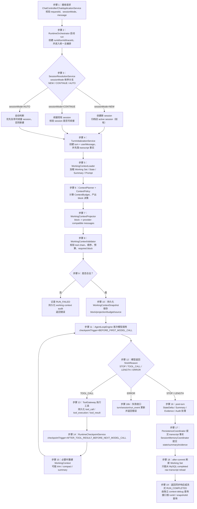

**图说明：**

1. `SessionResolutionService` 的分支必须显式基于 `SessionMode`。  
2. `TurnInitializationService` 先落 userMessage/turn，确保后续 state/evidence 有事实基础。  
3. `WorkingContextLoader` 加载的是多层 memory，不再是简单 session context。  
4. `WorkingContextValidator` 失败时直接中断本次 run，并保留审计数据。  
5. `after-commit` 刷新 Working Set 时，来源是 MySQL raw transcript，而不是 projection。

### 9.4 同步时序图

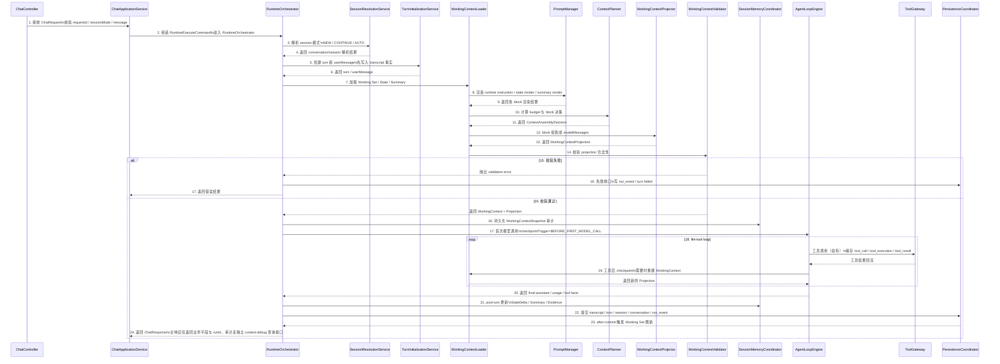

**关键解释：**

- 第 7～14 步是本次 P2 最核心的新链路。  
- 第 16 步的 WorkingContextSnapshot 落库是审计基础；即使之后失败，也能知道“本次到底打算给模型什么上下文”。  
- 第 21 步与第 22 步拆分：前者处理 memory，后者处理 transcript 事实。

### 9.5 流式时序图

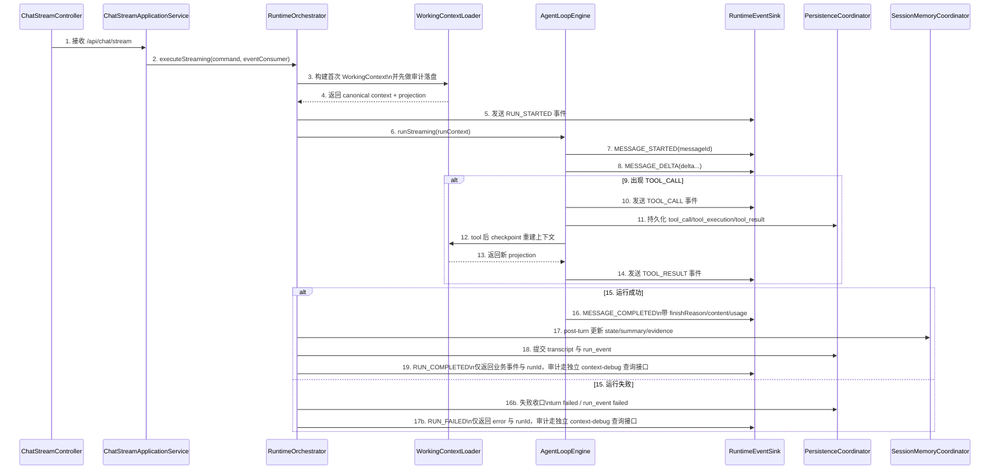

**关键解释：**

- 流式链路中，`MESSAGE_DELTA` 期间不允许持久化 state 主版本。  
- `RUN_COMPLETED` / `RUN_FAILED` 只返回业务事件与 `runId`；审计数据通过独立 `context-debug` 查询接口获取。  
- 工具事件依然必须通过统一 transcript facts 和 run event 进入主链路。

### 9.6 数据加载详细流程图

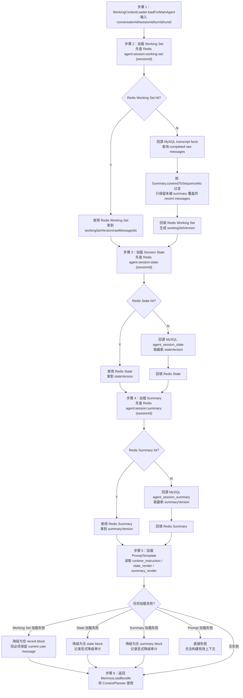

**关键解释：**

1. Working Set / State / Summary 三类数据独立加载，不再混用一个 `SessionStateLoader`。  
2. Prompt 模板加载失败不可降级；因为没有稳定前缀就无法构建合法上下文。  
3. Working Set 的 MySQL 回源必须依赖 `summaryCoveredToSequenceNo` 过滤老历史，避免 raw history 与 summary 重叠。

### 9.7 Prompt 渲染流程图

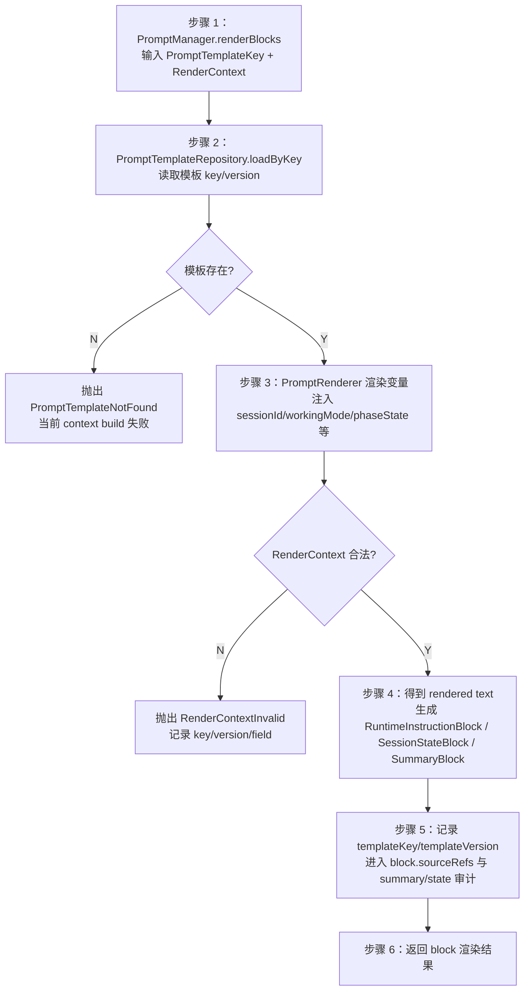

**关键解释：**

- `PromptManager.render(...)` 的职责是：**读取模板、校验 render context、执行变量替换、记录模板 key/version、返回 block 所需渲染文本**。  
- Prompt 不是散落字符串拼接，不允许写在 `RuntimeOrchestrator` 或 `SimpleAgentLoopEngine` 中。

### 9.8 Working Context 组装流程图

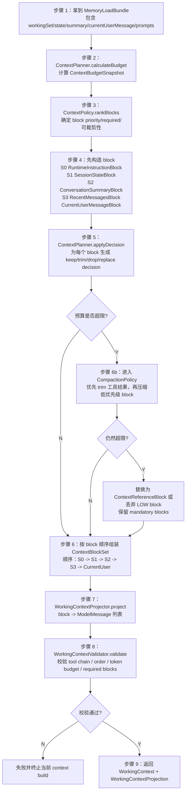

**关键解释：**

1. 这里明确了：`ContextPolicy`、`ContextBudget`、`CompactionPolicy` 都是核心对象，不是后续优化。  
2. `ContextBlockSet` 是统一管理 bean；不再把 S0/S1/S2/S3 粗暴塞成一个扁平 item list。  
3. `CurrentUserMessageBlock` 必须保底。  
4. `WorkingContextValidator` 是 projection 前后的质量闸门。

### 9.9 Loop + Checkpoint 流程图

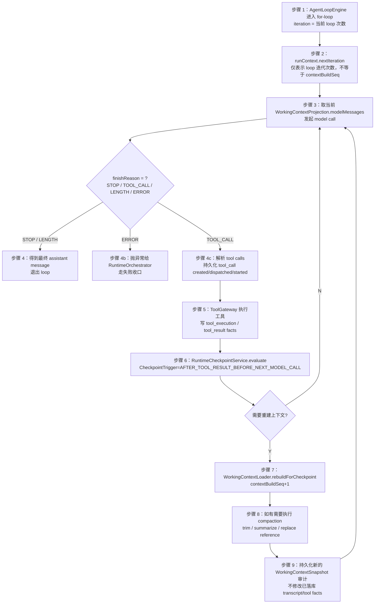

**关键解释：**

- `iteration` 表示 loop 次数；`contextBuildSeq` 表示当前 turn 内第几次构建 context；两者不是同一概念。  
- 每次 checkpoint 重建后的 WorkingContext 都必须重新审计落盘。  
- `CheckpointTrigger` 是触发原因枚举，不是计数器。

#### 9.9.1 Checkpoint / tool-chain 不可破坏规则

1. `checkpoint rebuild` 只能发生在 **tool result 已持久化并进入本轮 raw working transcript 之后、下一次 model call 之前**。  
2. rebuild 只影响 **下一次 `WorkingContextProjection`**，不回写旧 projection。  
3. rebuild 不得修改已落库 transcript facts / tool facts / message 顺序。  
4. 派生 block（state render / summary render / compaction note）不得插入未闭合 tool chain 中间。合法投影必须保持：`assistant(tool_call) -> tool(result)` 原始链路顺序不变。  
5. 每次 rebuild 都生成新的 `workingContextSnapshotId / contextBuildSeq / projectionId`，旧快照保留审计。  

### 9.10 State 抽取详细流程图

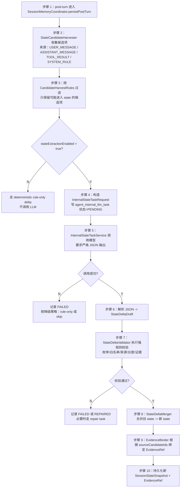

**关键解释：**

- `confirmedFacts / constraints / decisions / userPreferences` 不是“让模型自由猜”，而是先 candidate harvest，再让 LLM 做归并。  
- 后端解析不是直接信任 JSON，而是必须做 `StateDeltaValidator` 强规则校验。  
- `EvidenceRef` 由后端绑定，不让模型直接编完整证据实体。

### 9.11 Summary / Compaction 流程图

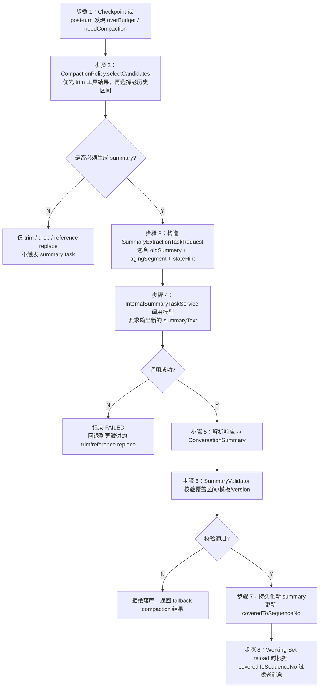

**关键解释：**

- Compaction 是一等能力，summary 只是其中一种结果。  
- 先 trim，再 summary；不是一超预算就强制总结。  
- summary 需要记录模板 key/version，方便后续评估和回放。

### 9.12 post-turn 持久化流程图

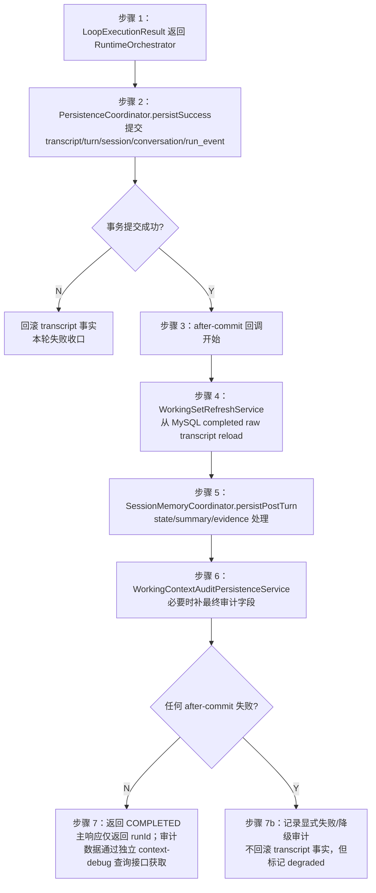

**关键解释：**

- transcript 事实提交与 working set / memory / audit 的 after-commit 行为分开。  
- 这样即使 after-commit 某个环节失败，也不会污染 transcript 主事实源。  
- `WorkingSetRefreshService` 一定先于 `WorkingContext` 下轮加载路径完成。

### 9.13 Working Context 审计流程图

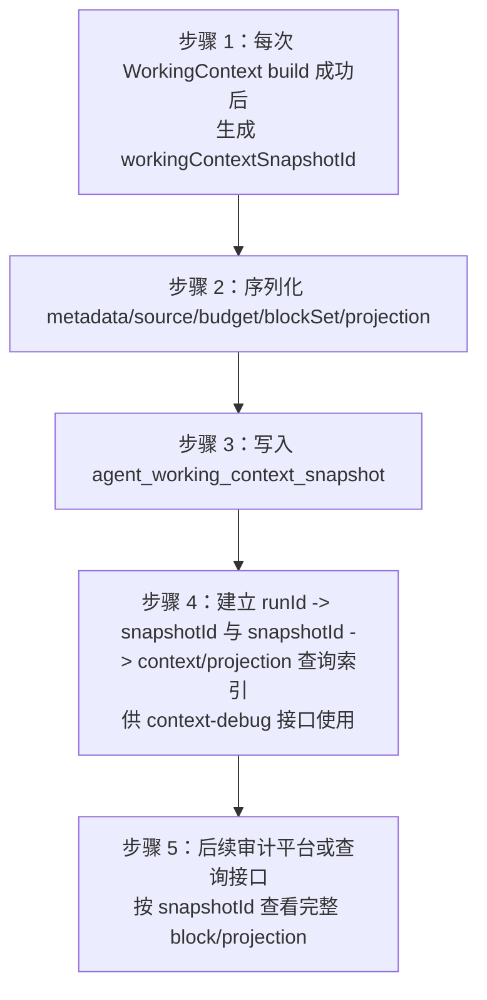

**关键解释：**

- 现在先落数据，不先做 UI 平台。  
- 审计粒度是 **每次 model call 一条**，不是每个 turn 一条。  
- 这是因为一个 turn 里可能经历多次 checkpoint 与重建。

### 9.14 `PersistenceCoordinator` 保留 Facade 的拆分方案

```java
class PersistenceCoordinator {
    TranscriptPersistenceService transcriptPersistenceService;        // 保存 user/assistant/tool message 与 tool facts
    RunEventPersistenceService runEventPersistenceService;            // 保存 run_event
    WorkingSetRefreshService workingSetRefreshService;                // after-commit 刷新 Working Set
    SessionMemoryPersistenceService sessionMemoryPersistenceService;  // 保存 state/summary/evidence
    WorkingContextAuditPersistenceService auditPersistenceService;    // 保存 working context 审计
}
```

#### 9.14.1 各子服务职责

| 子服务 | 职责 | 是否事务内 |
|---|---|---|
| `TranscriptPersistenceService` | message/tool_call/tool_execution/turn/session/conversation 基本事实写入 | 是 |
| `RunEventPersistenceService` | run_event 写入 | 是 |
| `WorkingSetRefreshService` | after-commit 从 MySQL reload raw transcript -> Redis Working Set | 否（after-commit） |
| `SessionMemoryPersistenceService` | state/summary/evidence 写入 MySQL + Redis | 默认 after-commit；state 可同步短超时 |
| `WorkingContextAuditPersistenceService` | WorkingContextSnapshot / InternalTaskAudit 写入 | 默认同步或 after-commit |

### 9.15 关键伪代码

#### 9.15.1 `WorkingContextLoader.loadForMainAgent(...)`

```java
WorkingContextBuildResult loadForMainAgent(LoadCommand command) {
    MemoryLoadBundle bundle = memoryService.loadForMainAgent(command);
    ContextBudgetSnapshot budget = contextBudgetCalculator.calculate(command, bundle);
    List<ContextBlock> blocks = blockFactory.buildMainAgentBlocks(command, bundle);
    ContextPlan contextPlan = contextPlanner.plan(blocks, budget, command.getAgentMode(), ContextViewType.MAIN_AGENT);
    ContextBlockSet blockSet = ContextBlockSet.of(contextPlan.getDecidedBlocks());
    WorkingContext context = workingContextBuilder.build(command, bundle, budget, blockSet);
    WorkingContextProjection projection = projector.project(context, ContextViewType.MAIN_AGENT);
    ProjectionValidationResult validationResult = validator.validate(context, projection);
    auditStore.save(context, projection, contextPlan, validationResult);
    return new WorkingContextBuildResult(context, projection, contextPlan, validationResult);
}
```

#### 9.15.2 `SessionMemoryCoordinator.persistPostTurn(...)`

```java
void persistPostTurn(PostTurnCommand command) {
    StateDelta delta = stateService.buildDelta(command);
    if (delta != null) {
        SessionStateSnapshot newState = stateMerger.merge(command.getPreviousState(), delta);
        List<EvidenceRef> evidenceRefs = evidenceBinder.bind(delta, command.getCandidateBundle(), command.getWorkingContextSnapshotId());
        stateStore.save(newState);
        evidenceStore.saveAll(evidenceRefs);
    }

    if (summaryPolicy.shouldRefresh(command)) {
        ConversationSummary summary = summaryService.refresh(command);
        if (summary != null) {
            summaryStore.save(summary);
        }
    }
}
```

#### 9.15.3 `RuntimeCheckpointService.evaluate(...)`

```java
CheckpointDecision evaluate(CheckpointTrigger trigger, WorkingContext context) {
    ContextBudgetSnapshot budget = context.getBudget();
    if (Boolean.TRUE.equals(budget.getOverBudget())) {
        return CheckpointDecision.rebuild(trigger, CheckpointReason.INPUT_BUDGET_NEAR_LIMIT);
    }
    if (trigger == CheckpointTrigger.AFTER_TOOL_RESULT_BEFORE_NEXT_MODEL_CALL
        && compactionPolicy.shouldCompactAfterTool(context)) {
        return CheckpointDecision.rebuild(trigger, CheckpointReason.TOOL_LOOP_EXPANDING);
    }
    return CheckpointDecision.noop(trigger);
}
```

---

## 10. 规则、策略与设计模式

### 10.1 需要维护的规则类别

| 规则类别 | 规则内容 | 典型实现 |
|---|---|---|
| `CandidateHarvestRules` | 哪些事实可以成为 state 候选项 | `StateCandidateHarvester` |
| `StateAdmissionRules` | 哪些候选项可进入 state 哪个字段 | `StateDeltaValidator` |
| `StateMergeRules` | state 合并如何 append / patch / override / close | `StateDeltaMerger` |
| `EvidenceBindingRules` | sourceCandidateId 如何绑定 evidence | `EvidenceBinder` |
| `FreshnessRules` | 哪些 tool digest/fact 需要 TTL 或重查 | `FreshnessPolicy` |
| `ContextBudgetRules` | 谁优先保留、谁可裁剪、谁可替换引用 | `ContextPolicy + ContextBudget` |
| `ProjectionValidationRules` | projected messages 是否合法 | `WorkingContextValidator` |
| `CompactionRules` | 何时 compact、compact 什么、compact 后如何替换 | `CompactionPolicy` |

### 10.2 `ContextPolicy` 设计

```java
interface ContextPolicy {
    List<ContextBlock> rankBlocks(List<ContextBlock> blocks, AgentMode agentMode);
    List<ContextAssemblyDecision> decide(List<ContextBlock> blocks, ContextBudgetSnapshot budget, ContextViewType viewType);
}
```

#### 10.2.1 `DefaultContextPolicy` 当前冻结策略

优先级顺序：

1. `RuntimeInstructionBlock`（MANDATORY）  
2. `CurrentUserMessageBlock`（MANDATORY）  
3. `SessionStateBlock`（HIGH）  
4. `RecentMessagesBlock`（HIGH）  
5. `ConversationSummaryBlock`（MEDIUM）  
6. `ContextReferenceBlock`（LOW，P2 预留）  
7. `CompactionNoteBlock`（LOW）

### 10.3 `ContextBudget` 设计

#### 10.3.1 预算公式

```text
availableInputBudget
= modelMaxInputTokens
- reservedOutputTokens
- reservedToolLoopTokens
- safetyMarginTokens
```

#### 10.3.2 Budget 行为规则

1. `RuntimeInstructionBlock` 和 `CurrentUserMessageBlock` 不得丢弃。  
2. `SessionStateBlock` 不得在存在时直接 drop，只能 trim render 内容。  
3. `RecentMessagesBlock` 只按完整 turn / 完整 tool cycle 裁剪，不允许 token 生切。  
4. `ConversationSummaryBlock` 可以压缩或替换为更短 render。  
5. `ContextReferenceBlock` 可以优先 drop。

### 10.4 `CompactionPolicy` 设计

```java
interface CompactionPolicy {
    boolean shouldCompact(WorkingContext context, CheckpointTrigger trigger);
    CompactionPlan selectCandidates(WorkingContext context);
    CompactionResult compact(CompactionPlan plan);
}
```

#### 10.4.1 当前 compaction 策略

1. 先 trim 低优先级工具结果文本。  
2. 再减少 `RecentMessagesBlock` 中的旧 turn，但必须保持完整 tool cycle。  
3. 再触发 `ConversationSummary` 刷新，扩大 summary 覆盖区间。  
4. 最后才考虑 `ContextReferenceBlock` 替换。  
5. 不允许丢弃 `CurrentUserMessageBlock`。

### 10.5 `FreshnessPolicy` 设计

```java
interface FreshnessPolicy {
    ToolOutcomeFreshnessPolicy resolve(String toolName);
    Duration ttl(String toolName);
    boolean mustRevalidate(ToolOutcomeDigest digest, Instant now);
}
```

#### 10.5.1 典型策略

| 工具 | FreshnessPolicy | 说明 |
|---|---|---|
| `calendar_check` | `TTL_CONFIGURED` | 日历结果有实时性 |
| `web_search` | `TTL_CONFIGURED` | 搜索结果会变化 |
| `repo_scan` | `TTL_CONFIGURED` | 项目扫描可以配置较长 TTL |
| `static_doc_lookup` | `SESSION` 或 `STATIC` | 静态文档查询变化慢 |
| `manual_approval` | `MANUAL_REVALIDATE` | 必须重新确认 |

### 10.6 `MemoryWritePolicy` 设计

| 数据类型 | 默认写策略 | 说明 |
|---|---|---|
| transcript facts | `HOT_PATH_SYNC` | 正式事实源，必须同步写 |
| run_event | `HOT_PATH_SYNC` | 正式事实源，必须同步写 |
| Working Set refresh | `AFTER_COMMIT_SYNC` | 事务提交后同步刷新 |
| Session State | `HOT_PATH_SYNC`（短超时，可降级） | 下一轮最重要的语义恢复对象 |
| Summary | `BACKGROUND_ASYNC`（需 compact 时可同步） | 默认后台更新 |
| EvidenceRef | 跟随 Session State 同步写 | 保证 state 可追溯 |
| WorkingContextSnapshot | `HOT_PATH_SYNC` | 每次 build 立即写审计 |
| InternalTaskAudit | `HOT_PATH_SYNC` | 内部任务发起即记审计 |

### 10.7 `WorkingContextValidator` 设计

```java
interface WorkingContextValidator {
    void validate(WorkingContext context, WorkingContextProjection projection);
}
```

#### 10.7.1 必须校验项

1. projected messages 顺序合法。  
2. tool call / tool result 链路合法。  
3. summary block 不得插入未闭合 tool cycle 中间。  
4. derived block 不得进入 transcript working set。  
5. required block 不缺失。  
6. token budget 不超。  
7. 当前 user message 必须存在且位于末尾。  
8. internal task view 不得带不需要的工具消息。

### 10.8 设计模式使用说明

| 模式 | 使用位置 | 作用 |
|---|---|---|
| `Facade` | `PersistenceCoordinator` / `SessionMemoryCoordinator` | 统一门面，内部拆协作者 |
| `Strategy` | `ContextPolicy` / `CompactionPolicy` / `FreshnessPolicy` / `MemoryWritePolicy` | 规则和策略可替换 |
| `Builder` | `WorkingContextBuilder` / `WorkingContextProjectionBuilder` | 构建长参数复杂对象 |
| `Validator Chain` | `WorkingContextValidator` / `StateDeltaValidator` | 规则链式校验 |
| `Projector` | `WorkingContextProjector` | block -> provider messages |
| `Rule Object / Specification` | harvest/admission/merge/freshness 规则 | 显式表达规则 |

---

## 11. Provider、Tool 与 Internal LLM Task 设计

### 11.1 `LlmGateway` 主调用保持不变

- 统一端口：`LlmGateway`
- 主对话返回：`ModelResponse`
- Provider-neutral 字段：
  - `content`
  - `toolCalls`
  - `finishReason`
  - `usage`
  - `provider`
  - `model`

### 11.2 主对话任务与 Internal LLM Task 的区别

| 维度 | 主对话任务 | Internal LLM Task |
|---|---|---|
| 目标 | 面向用户的回复 / tool call | 面向系统的结构化状态/摘要/修复 |
| 触发时机 | 用户请求驱动 | post-turn / checkpoint / compaction |
| 输入 | MAIN_AGENT `WorkingContextProjection` | INTERNAL_STATE_TASK / INTERNAL_SUMMARY_TASK view |
| 输出 | 自然语言 / tool calls | 严格 JSON / 结构化结果 |
| temperature | 常规 0.1~0.3 | 固定 0.0 |
| timeout | 用户主链路超时 | 更短，默认 10~15 秒 |
| retry | 通常不自动重试 | 可重试 1 次 |
| 失败影响 | 直接影响用户结果 | 默认允许降级，且不得反向修改已完成的主 run 状态 |
| 审计 | run_event / context snapshot | `agent_internal_llm_task` 审计表 + 显式 `INTERNAL_TASK_*` run_event |

#### 11.2.1 Internal LLM Task 写入与失败口径冻结

1. `RuntimeOrchestrator` 的主 run 一旦已经成功完成并写入 `COMPLETED`，后续 internal task 失败 **不得**反向把 turn/run 改回 `FAILED`。  
2. `STATE_EXTRACT` 默认短超时 hot-path；失败时先尝试 deterministic fallback：  
   - fallback 成功：`InternalTaskStatus=DEGRADED`，允许写入降级 state；  
   - fallback 失败：保留旧 stateVersion，记录 `FAILED`。  
3. `SUMMARY_EXTRACT` 默认 background；失败时保留旧 summaryVersion，记录 `FAILED`。  
4. internal task 的状态、请求、响应、错误码和耗时必须写入 `agent_internal_llm_task`。  
5. 主 run 的 `COMPLETED/FAILED` 与 internal task 的 `SUCCEEDED/FAILED/DEGRADED/SKIPPED` 状态必须解耦。  
6. internal task 的过程事件如写入 `agent_run_event`，必须使用显式 `INTERNAL_TASK_STARTED / INTERNAL_TASK_SUCCEEDED / INTERNAL_TASK_FAILED / INTERNAL_TASK_DEGRADED / INTERNAL_TASK_SKIPPED`，不得使用 `warning` / `error` 泛称。  

### 11.3 Internal LLM Task 输入 / 输出设计

#### 11.3.1 状态抽取任务

```java
class InternalStateTaskRequest {
    String internalTaskId;               // 内部任务 ID
    String sessionId;                    // session ID
    String turnId;                       // turn ID
    String runId;                        // run ID
    WorkingMode workingModeHint;         // 工作模式提示
    Long previousStateVersion;           // 上一版 state 版本
    List<StateCandidate> candidates;     // 候选项列表
    PromptTemplateRef templateRef;       // 模板引用
}

class InternalStateTaskResponse {
    StateDelta stateDelta;               // 输出的 state delta
}
```

#### 11.3.2 摘要抽取任务

```java
class InternalSummaryTaskRequest {
    String internalTaskId;               // 内部任务 ID
    String sessionId;                    // session ID
    String turnId;                       // turn ID
    String runId;                        // run ID
    Long previousSummaryVersion;         // 上一版 summary 版本
    Long coveredFromSequenceNo;          // 起始序号
    Long coveredToSequenceNo;            // 结束序号
    String previousSummaryText;          // 旧摘要
    List<Message> agingMessages;         // 待压缩消息
    PromptTemplateRef templateRef;       // 模板引用
}

class InternalSummaryTaskResponse {
    ConversationSummary summary;         // 输出 summary
}
```

### 11.4 ToolOutcomeDigest 重要性判断

**原则：不是所有工具结果都进入 `ToolOutcomeDigest`。**

#### 11.4.1 重要性判断规则

1. 工具结果会影响下一轮任务推进。  
2. 工具结果会影响用户决策或状态恢复。  
3. 原始 tool output 较大，不适合长期原样回灌。  
4. 工具结果未来仍有一定有效期。  
5. 能绑定明确 `toolCallRecordId / toolExecutionId`。

#### 11.4.2 不是为了“以后不再调 tool”

`ToolOutcomeDigest` 的核心作用是：

- 让 state 记住“最近工具做了什么、对当前任务意味着什么”；
- 减少每轮都把原始大 output 回灌模型；
- 为下一轮提供语义恢复。

是否重新调用 tool，仍然由 `FreshnessPolicy` 决定。

### 11.5 Provider-compatible 投影规则

1. `RuntimeInstructionBlock` -> `SystemMessage`  
2. `SessionStateBlock` -> `SystemMessage`  
3. `ConversationSummaryBlock` -> `SummaryMessage`（或 `SystemMessage` 中的 summary section，按 provider 风格）  
4. `RecentMessagesBlock` -> 保持原始 `User / Assistant / Tool` 消息顺序  
5. `CurrentUserMessageBlock` -> `UserMessage`，位于末尾  
6. `ContextReferenceBlock` -> 轻量 system/reference note，不直接当 raw transcript

---

## 12. 配置设计

### 12.1 推荐配置

```yaml
vi:
  agent:
    redis:
      ttl:
        request-cache-seconds: 3600
        session-lock-seconds: 60
        working-set-seconds: 1800
        state-seconds: 1800
        summary-seconds: 1800

    runtime:
      max-iterations: 6
      session-working-set:
        max-completed-turns: 5

    context:
      default-agent-mode: GENERAL
      budget:
        reserved-output-tokens: 1024
        reserved-tool-loop-tokens: 1536
        safety-margin-tokens: 512
        max-runtime-instruction-tokens: 1200
        max-state-render-tokens: 1200
        max-summary-tokens: 1600
      compaction:
        enabled: true
        trigger-ratio: 0.75
        max-tool-result-chars-before-trim: 1200
      audit:
        enabled: true
        persist-projection-json: true
      debug:
        query-enabled: true
        include-projection-by-default: false

    internal-task:
      enabled: true
      state-extract:
        timeout-ms: 12000
        max-retries: 1
        template-key: state_extract
        template-version: v1
      summary-extract:
        timeout-ms: 15000
        max-retries: 1
        template-key: summary_extract
        template-version: v1

    freshness:
      default-tool-ttl-seconds: 300
      policies:
        calendar_check: 300
        web_search: 600
        repo_scan: 1800
        static_doc_lookup: 86400
```

### 12.2 配置项说明

| 配置项 | 默认值 | 是否必填 | 说明 |
|---|---|---|---|
| `vi.agent.redis.ttl.request-cache-seconds` | 3600 | Y | 请求幂等缓存 TTL |
| `vi.agent.redis.ttl.session-lock-seconds` | 60 | Y | session 锁 TTL |
| `vi.agent.redis.ttl.working-set-seconds` | 1800 | Y | Working Set TTL |
| `vi.agent.redis.ttl.state-seconds` | 1800 | Y | State TTL |
| `vi.agent.redis.ttl.summary-seconds` | 1800 | Y | Summary TTL |
| `vi.agent.runtime.max-iterations` | 6 | Y | 最大 loop 次数 |
| `vi.agent.runtime.session-working-set.max-completed-turns` | 5 | Y | Working Set 最大 completed turn 数 |
| `vi.agent.context.budget.reserved-output-tokens` | 1024 | Y | 输出 token 预留 |
| `vi.agent.context.budget.reserved-tool-loop-tokens` | 1536 | Y | tool-loop token 预留 |
| `vi.agent.context.budget.safety-margin-tokens` | 512 | Y | 安全边界 |
| `vi.agent.context.default-agent-mode` | GENERAL | Y | 当前默认 agent mode，由 AgentModeResolver 使用 |
| `vi.agent.context.compaction.trigger-ratio` | 0.75 | Y | 超预算触发阈值 |
| `vi.agent.internal-task.enabled` | true | Y | 是否启用内部任务 |
| `vi.agent.freshness.policies.*` | 见示例 | N | 各工具 TTL 策略 |

### 12.3 配置校验规则

1. 所有 token 预算必须 > 0。  
2. `reserved-output-tokens + reserved-tool-loop-tokens + safety-margin-tokens` 不得超过模型最大输入。  
3. `trigger-ratio` 必须在 `(0,1)` 范围。  
4. TTL 配置不得为负数。  
5. internal task 模板 key/version 必须存在。

---

## 13. 可测试性与测试计划

### 13.1 必测场景

1. `SessionWorkingSetSnapshot` 只从 MySQL completed raw transcript reload，不从 projection 回刷。  
2. `WorkingContextLoader` 正确加载 Working Set / State / Summary / Prompt。  
3. `WorkingContextProjector` 生成的 messages 顺序合法。  
4. `WorkingContextValidator` 能识别 tool chain 非法、required block 缺失、预算超限。  
5. `StateCandidateHarvester + InternalStateTask + StateDeltaValidator + StateDeltaMerger` 主路径可跑通。  
6. `ConversationSummary` 模板 key/version 与覆盖区间正确落库。  
7. `RuntimeCheckpointService` 能在 tool 后触发 context rebuild。  
8. `WorkingContextSnapshot` 每次 model call 都会落盘。  
9. 同步 / 流式主链路不回退。  
10. request Redis key 仍使用 `agent:request:{requestId}`。  
11. `PersistenceCoordinator` 拆协作者后，事务边界不被破坏。
12. Internal LLM Task 的 run_event 使用显式 `INTERNAL_TASK_*` 类型，不出现 `warning` / `error` 泛称。

### 13.2 测试分层

#### 单元测试

- `ContextBudgetCalculatorTest`
- `DefaultContextPolicyTest`
- `WorkingContextProjectorTest`
- `WorkingContextValidatorTest`
- `StateCandidateHarvesterTest`
- `StateDeltaValidatorTest`
- `StateDeltaMergerTest`
- `FreshnessPolicyTest`
- `CompactionPolicyTest`

#### 集成测试

- `WorkingContextLoaderRedisMysqlFallbackIT`
- `RuntimeOrchestratorContextKernelIT`
- `SimpleAgentLoopEngineCheckpointIT`
- `PersistenceCoordinatorAfterCommitIT`
- `SessionMemoryCoordinatorPostTurnIT`
- `InternalLlmTaskAuditIT`

#### 回归测试

- `/api/chat` 主链路回归
- `/api/chat/stream` 主链路回归
- tool_call / tool_result 事实链路回归
- dedup requestId 命中回归
- sessionMode=NEW / CONTINUE / AUTO 三分支回归

### 13.3 旧测试冲突处理

- 与旧 `SessionStateSnapshot = recent messages cache` 语义绑定的测试，全部同步改名或删除。  
- 与 `workingMessages` 被当作 transcript source 的测试，全部重写。  
- 不保留为兼容旧测试而存在的过时代码。

### 13.4 整体回归点

1. `ChatController -> RuntimeOrchestrator -> AgentLoopEngine -> PersistenceCoordinator` 主链路必须保持可用。  
2. tool call / tool result 的对外 DTO 行为不回退。  
3. MySQL transcript 事实结构不被破坏。  
4. Redis request cache / session lock 行为不回退。  
5. 新增 debug/audit 能力默认不影响非 debug 请求。

---

## 14. 执行计划（本稿先给实施顺序，不冻结阶段名）

> 这里给的是 **实施顺序建议**，不是最终 A/B/C 阶段命名冻结稿。

| 顺序 | 工作流 | 目标 | 完成标准 |
|---|---|---|---|
| 1 | 命名收敛 | `SessionStateSnapshot` -> `SessionWorkingSetSnapshot`，拆开 Working Set 与 Session State | 老命名不再承担双重语义 |
| 2 | 模型与枚举落地 | `WorkingContext` / `ContextBlock` / `SessionState` / `Summary` / `Evidence` / 各枚举类全部落地 | model 层编译通过，Builder/注释完整 |
| 3 | DDL 与 repository port 落地 | 新表、新 Redis key、新 port、infra repository | MySQL/Redis 双层读写路径闭环 |
| 4 | `WorkingContextLoader` 主链路落地 | Prompt / Load / Plan / Project / Validate / Audit 打通 | 首次 model call 使用新上下文内核 |
| 5 | `PersistenceCoordinator` 内部拆协作者 | transcript / memory / audit / working set refresh 拆开 | Facade 保留、职责清晰 |
| 6 | checkpoint / compaction skeleton 落地 | tool 后重建上下文，预算逼近时可 trim/compact | loop 可多次安全重建 |
| 7 | state / summary internal task 落地 | state delta / summary 生成与持久化 | post-turn memory 闭环跑通 |
| 8 | debug / audit / regression 收口 | 独立 debug 查询接口、审计数据、测试与日志补齐 | 满足 review 与后续平台接入 |

---

## 15. 风险与回滚

### 15.1 风险清单

| 风险 | 影响 | 概率 | 应对方案 | Owner |
|---|---|---|---|---|
| Working Set 仍被 projection 污染 | transcript / memory 边界失真 | 高 | 强制 after-commit 从 MySQL reload，禁止 projection 回刷 | runtime |
| ContextBlock 设计过重导致实现复杂 | 实施成本上升 | 中 | 先做最少 5 个 block 子类；ContextReference/CompactionNote 可先骨架 | runtime |
| Internal LLM Task 输出不稳定 | state/summary 质量波动 | 中 | rule-first candidate harvest + validator + fallback | runtime |
| Summary 过早同步化拖慢主链路 | 响应时延上升 | 中 | 默认 background；仅 compaction 必要时同步 | runtime |
| 审计表写入过大 | 数据量增长 | 中 | 可配置 projection_json 持久化开关与清理策略 | infra |
| 新增 internal debug 查询接口 | 内部接口与审计数据量上升 | 低 | 主聊天协议保持不变，debug 查询接口只对内部开放 | app |

### 15.2 回滚策略

- 协议层无需回滚；主聊天协议未改动。  
- 数据层回滚：新表为追加式创建，不修改旧事实表；可通过 feature toggle 暂停写入。  
- 主链路回滚：如新 `WorkingContextLoader` 出现重大问题，可临时降级回“recent raw messages + current user”模式，但必须保留审计日志说明处于 degraded mode。

---

## 16. 验收标准

### 16.1 功能验收

1. 主模型输入不再直接等于 `runContext.workingMessages`。  
2. S0/S1/S2/S3 以 `ContextBlock` 形式正式存在。  
3. Working Set、Session State、Summary 三类 memory 边界清晰。  
4. Working Set 刷新只来自 MySQL completed raw transcript。  
5. post-turn 能生成并持久化 `SessionStateSnapshot` / `ConversationSummary` / `EvidenceRef`。  
6. 每次 model call 都能产生 `WorkingContextSnapshot` 审计记录。  
7. tool 后 checkpoint 能按策略重建上下文。  
8. Internal LLM Task 有独立请求/响应/审计链路。  
9. `context-debug` 查询接口能按 `runId / snapshotId` 返回 WorkingContext 审计数据。

### 16.2 架构与分层验收

- 不破坏模块依赖方向。  
- `RuntimeOrchestrator` 仍然是唯一主编排中心。  
- `PersistenceCoordinator` 保留 Facade，但内部职责拆清。  
- `ContextPolicy / ContextBudget / CompactionPolicy / WorkingContextValidator` 作为正式对象存在。  
- `EvidenceRef` 与 `ContextReference` 职责分离。

### 16.3 协议与数据验收

- 主聊天请求 / 响应 / 流式事件与设计一致。  
- 独立 `context-debug` 查询接口可按 `runId / snapshotId` 查询审计数据。  
- 新表 DDL 可执行，字段注释完整。  
- Redis key 命名与 TTL 配置一致。  
- state/summary/evidence/working context audit 可查询和重放。

### 16.4 测试验收

- 单元 / 集成 / 回归测试覆盖上述必测场景。  
- 与旧错误语义绑定的测试已清理或重建。  
- tool loop、stream、persistence 关键路径无回退。

---

## 17. 最终交付清单

1. **代码改造清单（类/包级别）**
   - model/context 新对象
   - model/memory 新对象与枚举
   - runtime/context / runtime/memory / runtime/persistence 新服务与策略
   - app internal debug query DTO / assembler 扩展
   - infra Redis/MySQL repository 实现
2. **配置改造清单**
   - context.budget
   - context.compaction
   - internal-task
   - freshness
   - redis ttl
3. **数据库脚本清单**
   - `V2__add_context_kernel_tables.sql`
4. **测试清单**
   - 单元测试
   - 集成测试
   - 回归测试
5. **接口与查询清单**
   - 主聊天协议保持瘦身
   - `context-debug` / `context-debug-snapshot` 查询接口
6. **文档清单**
   - 本文档
   - 受影响 AGENTS/ARCHITECTURE/CODE_REVIEW 同步收口

---

## 18. 给实现代理的执行指令模板（可直接复用）

```text
你现在是本仓库实现代理。先完整阅读并严格遵守：
1) 根目录 AGENTS.md
2) 根目录 PROJECT_PLAN.md
3) 根目录 ARCHITECTURE.md
4) 根目录 CODE_REVIEW.md
5) 本设计文档 system-design-P2.md

执行要求：
- 以本设计文档为主，旧文档冲突处直接以本稿为准
- 先完成命名收敛，再做模型、存储、主链路、checkpoint、internal task
- 不允许把 projection/modelMessages 回刷为 Working Set
- 不允许把 derived state/summary/context message 写入 transcript 主表
- 保留 PersistenceCoordinator 作为 Facade，但必须拆分内部协作者
- StateDelta / Summary / Evidence 的 LLM 输出必须经过强规则校验
- 每次 model call 必须持久化 WorkingContextSnapshot 审计
- 不得在 ChatResponse / ChatStreamEvent 中直接回传完整 debug 数据，审计查询走独立 context-debug 接口
- 如旧测试与新语义冲突，直接更新或删除，不保留过时代码
- 最终交付：代码、配置、Flyway 脚本、测试、变更总结
```

---

## 19. 文档维护规则

1. 本文档是 `vi-agent-core` 的 P2 Context Kernel 正式设计稿。  
2. 后续采用增量更新，不做无理由整体改写。  
3. 若根文档与本稿冲突，以更晚确认且更合理的正式设计为准，并同步回写根文档。  
4. 新设计点必须同步落到：
   - 术语
   - 协议
   - 领域对象
   - 数据设计
   - 主链路图
   - 规则/策略
   - 测试计划
5. 本稿先冻结整体设计，再拆开发阶段；开发阶段的 A/B/C 命名不反向影响本文档结构。
